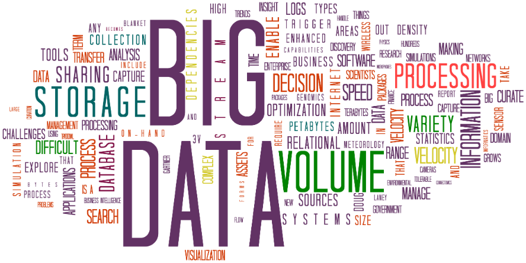

# AI School - 10회차
* 프로젝트로 익히는 실전 데이터 분석 및 딥러닝 입문

    파이썬@ 
       <a href='https://www.facebook.com/dongjo.lim.7'>LDJ</a>
    , [임동조](frontierlim13@gmail.com)

<h2><b>데이터 사이언티스트 실무자</b></h2>

## Notice for Team Project

세미 프로젝트 진행(웹 데이터 수집 및 시각화, 데이터 분석)
* 기간 : 2021.06.22(화) ~ 2021.06.25(화)  
  * STEP 01. 코로나 주제 선정  
  * STEP 02. 데이터 수집 및 처리/시각화, 간단한 분석 
  * STEP 03. 2021.06.24(목) 22:00 최종 결과물 제출 
  * STEP 04. 2021.06.25(금) 10:00 최종 결과물 발표 

* 팀별 최종 발표    
  * 2021.06.25(금) 10:00 (5-10분)

## Reference Documents

# 문서초안-세부 사항은 변경될 수 있음.
- Proj-01. [포트폴리오 자료      ][proj-01]
- Proj-02. [프로젝트 결과보고서 포맷   ][proj-02]

[proj-01]:  ./docu/LikeLion10_프로젝트보고서_포맷_OOO팀.docx "Go proj-01"
[proj-02]:  ./docu/LikeLion10_프로젝트보고서_포맷_OOO팀.docx "Go proj-02"

##  Team Project : Kick Off

- <b>1st Subject </b>: <b>Analyze Social Issues Using BigData </b>
- <b>Our Motto   </b>: <b>Learning by doing, doing by learning !! </b>
- <b>Report Format </b>: <a href="./docu/LikeLion10_프로젝트보고서_포맷_OOO팀.docx">(샘플)보고서 양식</a>
- ※ If you click on the image on the right, you can view "Initiation Report" by team.

<table border=1 bgcolor="#EEEEEE">
	<tr bgcolor="#CC0000">
		<td width="100">
		
<b>Team Name</b>

		</td>
		<td width="100">
		
<b>Team Building</b>

		</td>
		<td width="300">
		
<b>Project Subject</b>

		</td>
		<td width="120">
		
<b>Reports</b>

		</td>
	</tr>
	<tr>
		<td>
        
 
            1팀 (팀장:김동화)  
            <b>8조였던1조</b>                                                                                                   
</td>
		<td>
            
 
                 김동화 김남은, 김민수, 최민혁

        </td>
		<td>
 코로나 시각화 : GDP와 완치율의 상관관계, 대륙별 치명률과 완치률, 국내 지역별 확진자 지도 
</td>
		<td>
            
     
            

        </td>
	</tr>
	<tr>
		<td>
        
 
            2팀 (팀장:김현준)  
            <b>팀명</b>                                                                                                   
</td>
		<td>
            
 
                 김현준<____@naver.com>  김지연, 정희경 

        </td>
		<td>
 ____ 
</td>
		<td>
            
     
            

        </td>
	</tr>
	<tr>
		<td>
        
 
            사자들 (팀장:박성준)  
            <b></b>                                                                                                   
</td>
		<td>
            
 
                 박성준  박상엽, 이지은 

        </td>
		<td>
 백신의 효율적 공급을 위한 데이터 분석 
</td>
		<td>
            
     
            

        </td>
	</tr>
	<tr>
		<td>
        
 
            이희희 (팀장:이성준)  
            <b></b>                                                                                                   
</td>
		<td>
            
 
                 이성준  노진희, 조희창 

        </td>
		<td>
 코로나19 데이터를 통한 시각화 
</td>
		<td>
            
     
            

        </td>
	</tr>
	<tr>
		<td>
        
 
            5팀 (팀장:이응진)  
            <b>팀명</b>                                                                                                   
</td>
		<td>
            
 
                 이응진<___@gmail.com>  남연주, 류지인 

        </td>
		<td>
 코로나 예방 데이터 분석 
</td>
		<td>
            
     
            

        </td>
	</tr>
	<tr>
		<td>
        
 
            황금 시바견 (팀장:이예준)  
            <b></b>                                                                                                   
</td>
		<td>
            
 
                 이예준<kisb110116@gmail.com>  최수연, 최아름 

        </td>
		<td>
 GDP 상위/하위 10개국 간의 parameter 상관관계 비교 
</td>
		<td>
            
     
            

        </td>
	</tr>
	<tr>
		<td>
        
 
            7팀 (팀장:이준명)  
            <b>팀명</b>                                                                                                   
</td>
		<td>
            
 
                 이준명<kisb110116@gmail.com>  안현우, 양소연, 양효진 

        </td>
		<td>
 해커톤 대회 - 친환경 사이트 제작
</td>
		<td>
            
     
            

        </td>
	</tr>
	<tr>
		<td>
        
 
            8팀 (팀장:전명운)  
            <b>팀명</b>                                                                                                   
</td>
		<td>
            
 
                 전명운<kisb110116@gmail.com>  김현, 김혜린, 이규림 

        </td>
		<td>
 펭귄,___ 
</td>
		<td>
            
     
            

        </td>
	</tr>
</table>

 
### 멋쟁이 사자처럼 실무 데이터 사이언티스트 1기!  최고 멋진 친구들 버전 화이팅!!! ver3 ^^

##  Team Project : Final Report
- <b>Submission   </b>: 착수보고, 결과보고, 소스코드
- <b>Presentation </b>: 10min / team, Q&A
- <b>Keep in mind </b>: <b> Share Lessons Learned !! </b>

### Project Team A 

<table border=1 width=100%>
	<tr>
		<td width="25%">
<b>Project Team</b>
</td>
		<td width="75%">
 운송 수단 
</td>
	</tr>
	<tr>
		<td>
<b>Team Members</b>
</td>
		<td>
 김동화, 김남은, 김민수, 최민혁 
</td>
	</tr>
	<tr>
		<td>
<b>Report</b>
</td>
		<td>
			
 
				<a href="https://github.com/likelion-aischool-10-teamproject/corona-visualization">[A팀 결과보고]</a>, &nbsp;&nbsp;&nbsp; 
				<a href="reports/Team_A_code/">[A팀 소스코드]</a>  
			

		</td>
	</tr>
	<tr>
		<td>
<b>Subject</b>
</td>
		<td>
 프로젝트명 
</td>
	</tr>
	<tr>
		<td>
<b>Presentation</b>
</td>
		<td>

</td>
	</tr>
</table>

 

### Project Team B 

<table border=1 width=100%>
	<tr>
		<td width="25%">
<b>Project Team</b>
</td>
		<td width="75%">
 김현준 
</td>
	</tr>
	<tr>
		<td>
<b>Team Members</b>
</td>
		<td>
 김현준, 김지연, 정희경 
</td>
	</tr>
	<tr>
		<td>
<b>Report</b>
</td>
		<td>
			
 
				<a href="reports/Team_B_code/">[B팀 결과보고]</a>, &nbsp;&nbsp;&nbsp; 
				<a href="reports/Team_B_code/">[B팀 소스코드]</a>  
			

		</td>
	</tr>
	<tr>
		<td>
<b>Subject</b>
</td>
		<td>
 프로젝트명 
</td>
	</tr>
	<tr>
		<td>
<b>Presentation</b>
</td>
		<td>

</td>
	</tr>
</table>

 

### Project Team C 

<table border=1 width=100%>
	<tr>
		<td width="25%">
<b>Project Team</b>
</td>
		<td width="75%">
 사자들 
</td>
	</tr>
	<tr>
		<td>
<b>Team Members</b>
</td>
		<td>
 박성준, 박상엽, 이지은 
</td>
	</tr>
	<tr>
		<td>
<b>Report</b>
</td>
		<td>
			
 
				<a href="reports/사자들_박성준.pdf">[C팀 결과보고]</a>, &nbsp;&nbsp;&nbsp; 
				<a href="reports/Team_D_code">[C팀 소스코드]</a>  
			

		</td>
	</tr>
	<tr>
		<td>
<b>Subject</b>
</td>
		<td>
 백신의 효율적 공급을 위한 데이터 분석 
</td>
	</tr>
	<tr>
		<td>
<b>Presentation</b>
</td>
		<td>

</td>
	</tr>
</table>

 

### Project Team D 

<table border=1 width=100%>
	<tr>
		<td width="25%">
<b>Project Team</b>
</td>
		<td width="75%">
 이희희 
</td>
	</tr>
	<tr>
		<td>
<b>Team Members</b>
</td>
		<td>
 이성준, 노진희, 조희창 
</td>
	</tr>
	<tr>
		<td>
<b>Report</b>
</td>
		<td>
			
 
				<a href="reports/https://www.notion.so/6-22-24-bf51706870a346f193cd6da1c5e43b1d">[D팀 결과보고]</a>, &nbsp;&nbsp;&nbsp; 
			

		</td>
	</tr>
	<tr>
		<td>
<b>Subject</b>
</td>
		<td>
 코로나19 데이터를 통한 시각화 
</td>
	</tr>
	<tr>
		<td>
<b>Presentation</b>
</td>
		<td>

</td>
	</tr>
</table>

### Project Team E 

<table border=1 width=100%>
	<tr>
		<td width="25%">
<b>Project Team</b>
</td>
		<td width="75%">
 이응진 
</td>
	</tr>
	<tr>
		<td>
<b>Team Members</b>
</td>
		<td>
 이응진, 남연주, 류지인 
</td>
	</tr>
	<tr>
		<td>
<b>Report</b>
</td>
		<td>
			
 
				<a href="https://www.notion.so/268988daf8bc4f52a8f6ee05664c4f32">[D팀 결과보고]</a>, &nbsp;&nbsp;&nbsp; 
				<a href="reports/Team_F_code">[D팀 소스코드]</a>  
			

		</td>
	</tr>
	<tr>
		<td>
<b>Subject</b>
</td>
		<td>
 코로나 예방 데이터 분석 
</td>
	</tr>
	<tr>
		<td>
<b>Presentation</b>
</td>
		<td>

</td>
	</tr>
</table>

 

### Project Team F 

<table border=1 width=100%>
	<tr>
		<td width="25%">
<b>Project Team</b>
</td>
		<td width="75%">
 황금 시바견 
</td>
	</tr>
	<tr>
		<td>
<b>Team Members</b>
</td>
		<td>
 이예준, 최수연, 최아름 
</td>
	</tr>
	<tr>
		<td>
<b>Report</b>
</td>
		<td>
			
 
				<a href="reports/Team_F_code">[F팀 결과보고]</a>, &nbsp;&nbsp;&nbsp; 
				<a href="reports/Team_F_code">[F팀 소스코드]</a>  
			

		</td>
	</tr>
	<tr>
		<td>
<b>Subject</b>
</td>
		<td>
 GDP 상위/하위 10개국 간의 parameter 상관관계 비교 
</td>
	</tr>
	<tr>
		<td>
<b>Presentation</b>
</td>
		<td>

</td>
	</tr>
</table>

### Project Team G 

<table border=1 width=100%>
	<tr>
		<td width="25%">
<b>Project Team</b>
</td>
		<td width="75%">
 이준명 
</td>
	</tr>
	<tr>
		<td>
<b>Team Members</b>
</td>
		<td>
 이준명, 안현우, 양소연, 양효진 
</td>
	</tr>
	<tr>
		<td>
<b>Report</b>
</td>
		<td>
			
 
				<a href="reports/해커톤_이준명_대회.pdf">[G팀 결과보고]</a>, &nbsp;&nbsp;&nbsp; 
				<a href="reports/Team_E_warning/code/">[G팀 소소코드]</a>  
			

		</td>
	</tr>
	<tr>
		<td>
<b>Subject</b>
</td>
		<td>
 해커톤 친환경 사이트 제작
</td>
	</tr>
	<tr>
		<td>
<b>Presentation</b>
</td>
		<td>

</td>
	</tr>
</table>

### Project Team H 

<table border=1 width=100%>
	<tr>
		<td width="25%">
<b>Project Team</b>
</td>
		<td width="75%">
 전명운 
</td>
	</tr>
	<tr>
		<td>
<b>Team Members</b>
</td>
		<td>
 전명운, 김현, 김혜린, 이규림 
</td>
	</tr>
	<tr>
		<td>
<b>Report</b>
</td>
		<td>
			
 
				<a href="reports/00_New_06_24_214827.pdf">[H팀 결과보고]</a>, &nbsp;&nbsp;&nbsp; 
				<a href="reports/Team_E_warning/code/">[H팀 소스코드]</a>  
			

		</td>
	</tr>
	<tr>
		<td>
<b>Subject</b>
</td>
		<td>
 프로젝트 
</td>
	</tr>
	<tr>
		<td>
<b>Presentation</b>
</td>
		<td>

</td>
	</tr>
</table>

 

 &lt; The End &gt; 

