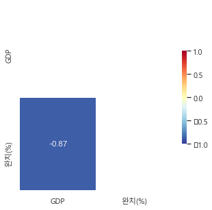

##### Team Project 01 by 김남은

# GDP 상위 7개 국가와 코로나 국가 간의 상관관계

## 목표 >

###### GDP 금액으로 유추해 보는 코로나에 대처하는 국가들의 상관관계

#### 참조링크

###### 1. 코로나 실시간 상황판 
    * https://coronaboard.kr/
###### 2. GDP 금액과 국가 순위 
    * http://search.daum.net/searchnil_suggest=btn&w=tot&DA=SBC&q=%EC%84%B8%EA%B3%84+gdp+%EC%88%9C%EC%9C%84

## 과정 >

###### 1) GDP 데이터를 추출한다.
###### 2) 코로나 실시간 상황판에서 데이터를 추출한다.
###### 3) 국가이름으로 데이터를 병합하기 위해 코로나 데이터에서 국가 코드를 제거한다.
###### 4) 두 데이터를 병합한다.
###### 5) 병합된 데이터의 GDP금액을 숫자형으로 치환한다.
###### 6) 시각화 한다.

## 결과 >


## 해석 및 향후 개선 사항 >

* GDP가 높으면 생활수준이 높아 질병에 대한 대처가 신속할 것으로 예상하여, 완치율이 높을 것이라 생각하였다. 그러나, GDP와 코로나 완치율이 음의 상관관계로 확인된 것으로 미루어, GDP가 높아도 코로나에 대한 대처는 아직까지 미흡한 것으로 보인다.
  
* 데이터 전처리에 있어서 많은 애로사항이 있었다.
    * 국가코드 제거, GDP 금액의 한글 제거 후 숫자로 치환
  
* NaN 값으로 인해 데이터 시각화가 너무 단순하게 처리된 거 같아 데이터를 의미있는 값으로 변경 후 재시각화를 해야겠다.

### 필수 라이브러리


```python
from IPython.display import display, Image
import os, warnings
import re
warnings.filterwarnings(action='ignore')

from selenium import webdriver
from bs4 import BeautifulSoup

import time
```

#### 1. 웹 드라이버 객체 할당 & 크롤링 위한 웹 페이지 띄우기


```python
driver = webdriver.Chrome('./chromedriver_90')
driver2 = webdriver.Chrome('./chromedriver_90')

url = 'https://coronaboard.kr/' 
url2 = 'http://search.daum.net/search?nil_suggest=btn&w=tot&DA=SBC&q=%EC%84%B8%EA%B3%84+gdp+%EC%88%9C%EC%9C%84'

driver.get(url)
driver2.get(url2)

time.sleep(3)  # 필수는 아니지만, 서버에서 크롤링 할 때 과부하를 막기 위함?!
```

#### 2. GDP 국가 및 GDP 금액 데이터 추출하기


```python
page = driver2.page_source
soup = BeautifulSoup(page, 'html.parser')

gdp_country = [] #GDP 국가들
gdp_list = [] #GDP 금액들

sel_btn = driver2.find_element_by_xpath('//*[@id="dklColl"]/div/div[22]/a[2]')
sel_btn.click()  # 1부터 18페이지까지 클릭

country = soup.find_all("a", class_="link_name")
country = list(country)

gdp = soup.find_all("td", class_="txt_ar")
gdp = list(gdp)

for one in country:
    one = one.text
    gdp_country.append(one)

for one_gdp in gdp:      # 조 억 만 단위 숫자로 치환
    one_gdp = one_gdp.text
    jo  = 0
    eog = 0
    man = 0
    if '조' in one_gdp :
        jo_idx = one_gdp.index('조')
        eog_idx = one_gdp.index('억')
        jo = int(one_gdp[:jo_idx]) * 1000000000000
        eog = int(one_gdp[ (jo_idx+1 ): eog_idx]) * 100000000
        man = int(one_gdp[ (eog_idx+1) : -1]) * 10000
    elif '억' in one_gdp :
        eog_idx = one_gdp.index('억')
        eog = int(one_gdp[:eog_idx]) * 100000000
    if '만' in one_gdp :
        man = int(one_gdp[ (eog_idx+1) : -1]) * 10000
    else :
        man = int(one_gdp[:-1]) * 10000
    one_gdp = jo + eog + man
    print(one_gdp)
    gdp_list.append(one_gdp)  
```

    21439453000000
    14140163000000
    5154475000000
    3863344000000
    2935570000000
    2743586000000
    2707074000000
    1988636000000
    1847020000000
    1730914000000
    1637892000000
    1629532000000
    1397870000000
    1376255000000
    1274175000000
    1111713000000
    902355000000
    779289000000
    743708000000
    715360000000
    586104000000
    565854000000
    529177000000
    528929000000
    517609000000
    458545850000
    447718000000
    446543000000
    445469000000
    417627000000
    405771000000
    387717000000
    384940000000
    365303000000
    362818000000
    358839000000
    356814000000
    347176000000
    327895000000
    317465000000
    302256000000
    294237000000
    284214000000
    269654000000
    261637000000
    246953000000
    243698000000
    236408000000
    228989000000
    224462000000
    214012000000
    204671000000
    191849000000
    172781000000
    170407000000
    170326000000
    150401000000
    137591000000
    119040000000
    107914000000
    106552000000
    99913000000
    98607000000
    91527000000
    91166000000
    89475000000
    86566000000
    81318000000
    76609000000
    70140000000
    69453000000
    68536000000
    67077000000
    66250000000
    65994000000
    62572000000
    62224000000
    61021000000
    60702000000
    60490000000
    59918000000
    58565000000
    54154000000
    53641000000
    51523000000
    48994000000
    47171000000
    46674000000
    44439000000
    44172000000
    42401000000
    40714000000
    38732000000
    38632000000
    38184000000
    35045000000
    33018000000
    31038000000
    30873000000
    30666000000
    29855000000
    29813000000
    26871000000
    26730000000
    24449000000
    24280000000
    23946000000
    23940000000
    23918000000
    23587000000
    22607000000
    20106000000
    19127000000
    18734000000
    18690000000
    17647000000
    16877000000
    15925000000
    15702000000
    15418000000
    15093000000
    14859000000
    14593000000
    14391000000
    14374000000
    14368000000
    13637000000
    13444000000
    13368000000
    12818000000
    12672000000
    12664000000
    12550000000
    12528000000
    12455000000
    12142000000
    11688000000
    11576000000
    11026000000
    10209000000
    9443000000
    8819000000
    8261000000
    8152000000
    7996000000
    7522000000
    5786000000
    5708000000
    5651000000
    5502000000
    5424000000
    5189000000
    4958000000
    4657000000
    4229000000
    4121000000
    3774000000
    3681000000
    3573000000
    3222000000
    3166000000
    2938000000
    2842000000
    2741000000
    2321000000
    2110000000
    2013000000
    2001000000
    1992000000
    1773000000
    1688000000
    1644000000
    1591000000
    1440000000
    1397000000
    1238000000
    1179000000
    1032000000
    951000000
    905000000
    856000000
    593000000
    488000000
    430000000
    381000000
    291000000
    220000000
    184000000
    108000000
    0
    

#### 3. GDP 국가 및 금액 데이터 만들기


```python
import pandas as pd

gdp_dat = {"국가":gdp_country[:7]+gdp_country[-7:],"GDP($)":gdp_list[:7]+gdp_list[-7:]}
dat= pd.DataFrame(gdp_dat)
dat
```


<div>
<style scoped>
    .dataframe tbody tr th:only-of-type {
        vertical-align: middle;
    }

    .dataframe tbody tr th {
        vertical-align: top;
    }

    .dataframe thead th {
        text-align: right;
    }
</style>
<table border="1" class="dataframe">
  <thead>
    <tr style="text-align: right;">
      <th></th>
      <th>국가</th>
      <th>GDP($)</th>
    </tr>
  </thead>
  <tbody>
    <tr>
      <th>0</th>
      <td>미국</td>
      <td>21439453000000</td>
    </tr>
    <tr>
      <th>1</th>
      <td>중국</td>
      <td>14140163000000</td>
    </tr>
    <tr>
      <th>2</th>
      <td>일본</td>
      <td>5154475000000</td>
    </tr>
    <tr>
      <th>3</th>
      <td>독일</td>
      <td>3863344000000</td>
    </tr>
    <tr>
      <th>4</th>
      <td>인도</td>
      <td>2935570000000</td>
    </tr>
    <tr>
      <th>5</th>
      <td>영국</td>
      <td>2743586000000</td>
    </tr>
    <tr>
      <th>6</th>
      <td>프랑스</td>
      <td>2707074000000</td>
    </tr>
    <tr>
      <th>7</th>
      <td>상투메 프린시페</td>
      <td>430000000</td>
    </tr>
    <tr>
      <th>8</th>
      <td>미크로네시아</td>
      <td>381000000</td>
    </tr>
    <tr>
      <th>9</th>
      <td>팔라우</td>
      <td>291000000</td>
    </tr>
    <tr>
      <th>10</th>
      <td>마셜 제도</td>
      <td>220000000</td>
    </tr>
    <tr>
      <th>11</th>
      <td>키리바시</td>
      <td>184000000</td>
    </tr>
    <tr>
      <th>12</th>
      <td>나우루</td>
      <td>108000000</td>
    </tr>
    <tr>
      <th>13</th>
      <td>투발루</td>
      <td>0</td>
    </tr>
  </tbody>
</table>
</div>


#### 4. 코로나 실시간 현황판에서 데이터 추출하기


```python
from selenium.webdriver import ActionChains  # ActionChains 라이브러리 이용해서
import time
some_tag = driver.find_element_by_id('show-more')   # id='show-more'를 driver로 찾기 
ActionChains(driver).move_to_element(some_tag).perform() #some_tag element로 이동해서
some_tag.click()  #some_tag로 클릭
time.sleep(3)
some_tag.click()  # 다음페이지로 넘어가기 위해 다시 some_tag로 클릭
```

#### - xpath에서 국가 데이터 갖고오는지 확인


```python
co_country = driver.find_elements_by_xpath('//*[@id="country-table"]/div/div/table/tbody/tr/td[2]')

for co_one in co_country:
    print(co_one.text)
```

    미국🇺🇸
    인도🇮🇳
    브라질🇧🇷
    프랑스🇫🇷
    러시아🇷🇺
    터키🇹🇷
    영국🇬🇧
    아르헨티나🇦🇷
    이탈리아🇮🇹
    콜롬비아🇨🇴
    스페인🇪🇸
    독일🇩🇪
    이란🇮🇷
    폴란드🇵🇱
    멕시코🇲🇽
    우크라이나🇺🇦
    인도네시아🇮🇩
    페루🇵🇪
    남아프리카 공화국🇿🇦
    네덜란드🇳🇱
    체코🇨🇿
    칠레🇨🇱
    캐나다🇨🇦
    필리핀🇵🇭
    이라크🇮🇶
    스웨덴🇸🇪
    벨기에🇧🇪
    루마니아🇷🇴
    파키스탄🇵🇰
    방글라데시🇧🇩
    포르투갈🇵🇹
    이스라엘🇮🇱
    헝가리🇭🇺
    일본🇯🇵*
    요르단🇯🇴
    말레이시아🇲🇾
    세르비아🇷🇸
    스위스🇨🇭
    오스트리아🇦🇹
    네팔🇳🇵
    아랍에미레이트🇦🇪
    레바논🇱🇧
    모로코🇲🇦
    사우디아라비아🇸🇦
    에콰도르🇪🇨
    볼리비아🇧🇴
    불가리아🇧🇬
    그리스🇬🇷
    카자흐스탄🇰🇿
    벨라루스🇧🇾
    파라과이🇵🇾
    파나마🇵🇦
    슬로바키아🇸🇰
    튀니지🇹🇳
    조지아🇬🇪
    우루과이🇺🇾
    크로아티아🇭🇷
    코스타리카🇨🇷
    쿠웨이트🇰🇼
    아제르바이잔🇦🇿
    도미니카 공화국🇩🇴
    팔레스타인🇵🇸
    덴마크🇩🇰
    과테말라🇬🇹
    이집트🇪🇬
    리투아니아🇱🇹
    에티오피아🇪🇹
    아일랜드🇮🇪
    베네수엘라🇻🇪
    바레인🇧🇭
    슬로베니아🇸🇮
    오만🇴🇲
    몰도바🇲🇩
    온두라스🇭🇳
    스리랑카🇱🇰
    태국🇹🇭
    아르메니아🇦🇲
    카타르🇶🇦
    보스니아 헤르체고비나🇧🇦
    리비아🇱🇾
    케냐🇰🇪
    쿠바🇨🇺
    나이지리아🇳🇬
    북마케도니아🇲🇰
    대한민국🇰🇷
    미얀마🇲🇲
    라트비아🇱🇻
    알제리🇩🇿
    잠비아🇿🇲
    알바니아🇦🇱
    에스토니아🇪🇪
    노르웨이🇳🇴
    키르기스스탄🇰🇬
    아프가니스탄🇦🇫
    우즈베키스탄🇺🇿
    코소보🇽🇰
    몽골🇲🇳
    몬테네그로🇲🇪
    가나🇬🇭
    핀란드🇫🇮
    중국🇨🇳
    카메룬🇨🇲
    엘살바도르🇸🇻
    나미비아🇳🇦
    우간다🇺🇬
    키프로스🇨🇾
    모잠비크🇲🇿
    몰디브🇲🇻
    룩셈부르크🇱🇺
    보츠와나🇧🇼
    싱가포르🇸🇬
    자메이카🇯🇲
    코트디부아르🇨🇮
    캄보디아🇰🇭
    짐바브웨🇿🇼
    세네갈🇸🇳
    마다가스카르🇲🇬
    콩고민주공화국🇨🇩
    앙골라🇦🇴
    수단🇸🇩
    말라위🇲🇼
    르완다🇷🇼
    카보베르데🇨🇻
    트리니다드 토바고🇹🇹
    몰타 공화국🇲🇹
    호주🇦🇺
    레위니옹🇷🇪
    프랑스령 기아나🇬🇫
    시리아🇸🇾
    가봉🇬🇦
    기니🇬🇳
    수리남🇸🇷
    모리타니🇲🇷
    마요트🇾🇹
    가이아나🇬🇾
    프랑스령 폴리네시아🇵🇫
    에스와티니🇸🇿
    아이티🇭🇹
    파푸아뉴기니🇵🇬
    과들루프🇬🇵
    소말리아🇸🇴
    세이셸🇸🇨
    말리🇲🇱
    대만🇹🇼
    베트남🇻🇳
    안도라🇦🇩
    토고🇹🇬
    부르키나파소🇧🇫
    타지키스탄🇹🇯
    벨리즈🇧🇿
    바하마🇧🇸
    콩고공화국🇨🇬
    퀴라소🇨🇼
    마르티니크🇲🇶
    홍콩🇭🇰
    지부티🇩🇯
    레소토🇱🇸
    아루바🇦🇼
    남수단🇸🇸
    동티모르🇹🇱
    적도 기니🇬🇶
    베냉🇧🇯
    니카라과🇳🇮
    중앙아프리카 공화국🇨🇫
    예멘🇾🇪
    아이슬란드🇮🇸
    감비아🇬🇲
    에리트레아🇪🇷
    니제르🇳🇪
    부룬디🇧🇮
    세인트루시아🇱🇨
    산마리노🇸🇲
    시에라리온🇸🇱
    차드🇹🇩
    지브롤터🇬🇮
    바베이도스🇧🇧
    코모로🇰🇲
    기니비사우🇬🇼
    라이베리아🇱🇷
    리히텐슈타인🇱🇮
    피지🇫🇯
    뉴질랜드🇳🇿
    신트마르턴🇸🇽
    모나코🇲🇨
    버뮤다🇧🇲
    터크스 케이커스 제도🇹🇨
    상투메 프린시페🇸🇹
    세인트빈센트 그레나딘🇻🇨
    세인트마틴 섬🇲🇫
    라오스🇱🇦
    부탄🇧🇹
    모리셔스🇲🇺
    카리브 네덜란드🇧🇶
    맨섬🇮🇲
    앤티가 바부다🇦🇬
    생바르텔레미🇧🇱
    페로 제도🇫🇴
    케이맨 제도🇰🇾
    탄자니아🇹🇿
    왈리스 퓌티나🇼🇫
    세인트키츠 네비스🇰🇳
    영국령 버진아일랜드🇻🇬
    브루나이🇧🇳
    도미니카 연방🇩🇲
    그레나다🇬🇩
    뉴칼레도니아🇳🇨
    앵귈라🇦🇮
    포클랜드 제도🇫🇰
    마카오🇲🇴
    그린란드🇬🇱
    바티칸 시국🇻🇦
    생피에르 미클롱🇵🇲
    몬트세랫🇲🇸
    솔로몬 제도🇸🇧
    서사하라🇪🇭
    잔담(크루즈)🚢
    마셜 제도🇲🇭
    바누아투🇻🇺
    사모아🇼🇸
    세인트헬레나🇸🇭
    미크로네시아🇫🇲
    

#### - 모든 데이터 확인


```python
all_corona_data = []   # 코로나 실시간 상황판에서의 세계 데이터 담을 List
for i in range(2, 9):  # xpath의 규칙을 확인해보니 td[] 안의 숫자로 국가, 확진자 등 확인  
    tmp = '//*[@id="country-table"]/div/div/table/tbody/tr/td[{}]'.format(i)
    # print(tmp)
    sel_ele = driver.find_elements_by_xpath(tmp)
    column_data = []
    for one in sel_ele:
        # print(one.text)
        column_data.append(one.text)
    all_corona_data.append(column_data)
    print(column_data)
    print()
all_corona_data
```

    ['미국🇺🇸', '인도🇮🇳', '브라질🇧🇷', '프랑스🇫🇷', '러시아🇷🇺', '터키🇹🇷', '영국🇬🇧', '아르헨티나🇦🇷', '이탈리아🇮🇹', '콜롬비아🇨🇴', '스페인🇪🇸', '독일🇩🇪', '이란🇮🇷', '폴란드🇵🇱', '멕시코🇲🇽', '우크라이나🇺🇦', '인도네시아🇮🇩', '페루🇵🇪', '남아프리카 공화국🇿🇦', '네덜란드🇳🇱', '체코🇨🇿', '칠레🇨🇱', '캐나다🇨🇦', '필리핀🇵🇭', '이라크🇮🇶', '스웨덴🇸🇪', '벨기에🇧🇪', '루마니아🇷🇴', '파키스탄🇵🇰', '방글라데시🇧🇩', '포르투갈🇵🇹', '이스라엘🇮🇱', '헝가리🇭🇺', '일본🇯🇵*', '요르단🇯🇴', '말레이시아🇲🇾', '세르비아🇷🇸', '스위스🇨🇭', '오스트리아🇦🇹', '네팔🇳🇵', '아랍에미레이트🇦🇪', '레바논🇱🇧', '모로코🇲🇦', '사우디아라비아🇸🇦', '에콰도르🇪🇨', '볼리비아🇧🇴', '불가리아🇧🇬', '그리스🇬🇷', '카자흐스탄🇰🇿', '벨라루스🇧🇾', '파라과이🇵🇾', '파나마🇵🇦', '슬로바키아🇸🇰', '튀니지🇹🇳', '조지아🇬🇪', '우루과이🇺🇾', '크로아티아🇭🇷', '코스타리카🇨🇷', '쿠웨이트🇰🇼', '아제르바이잔🇦🇿', '도미니카 공화국🇩🇴', '팔레스타인🇵🇸', '덴마크🇩🇰', '과테말라🇬🇹', '이집트🇪🇬', '리투아니아🇱🇹', '에티오피아🇪🇹', '아일랜드🇮🇪', '베네수엘라🇻🇪', '바레인🇧🇭', '슬로베니아🇸🇮', '오만🇴🇲', '몰도바🇲🇩', '온두라스🇭🇳', '스리랑카🇱🇰', '태국🇹🇭', '아르메니아🇦🇲', '카타르🇶🇦', '보스니아 헤르체고비나🇧🇦', '리비아🇱🇾', '케냐🇰🇪', '쿠바🇨🇺', '나이지리아🇳🇬', '북마케도니아🇲🇰', '대한민국🇰🇷', '미얀마🇲🇲', '라트비아🇱🇻', '알제리🇩🇿', '잠비아🇿🇲', '알바니아🇦🇱', '에스토니아🇪🇪', '노르웨이🇳🇴', '키르기스스탄🇰🇬', '아프가니스탄🇦🇫', '우즈베키스탄🇺🇿', '코소보🇽🇰', '몽골🇲🇳', '몬테네그로🇲🇪', '가나🇬🇭', '핀란드🇫🇮', '중국🇨🇳', '카메룬🇨🇲', '엘살바도르🇸🇻', '나미비아🇳🇦', '우간다🇺🇬', '키프로스🇨🇾', '모잠비크🇲🇿', '몰디브🇲🇻', '룩셈부르크🇱🇺', '보츠와나🇧🇼', '싱가포르🇸🇬', '자메이카🇯🇲', '코트디부아르🇨🇮', '캄보디아🇰🇭', '짐바브웨🇿🇼', '세네갈🇸🇳', '마다가스카르🇲🇬', '콩고민주공화국🇨🇩', '앙골라🇦🇴', '수단🇸🇩', '말라위🇲🇼', '르완다🇷🇼', '카보베르데🇨🇻', '트리니다드 토바고🇹🇹', '몰타 공화국🇲🇹', '호주🇦🇺', '레위니옹🇷🇪', '프랑스령 기아나🇬🇫', '시리아🇸🇾', '가봉🇬🇦', '기니🇬🇳', '수리남🇸🇷', '모리타니🇲🇷', '마요트🇾🇹', '가이아나🇬🇾', '프랑스령 폴리네시아🇵🇫', '에스와티니🇸🇿', '아이티🇭🇹', '파푸아뉴기니🇵🇬', '과들루프🇬🇵', '소말리아🇸🇴', '세이셸🇸🇨', '말리🇲🇱', '대만🇹🇼', '베트남🇻🇳', '안도라🇦🇩', '토고🇹🇬', '부르키나파소🇧🇫', '타지키스탄🇹🇯', '벨리즈🇧🇿', '바하마🇧🇸', '콩고공화국🇨🇬', '퀴라소🇨🇼', '마르티니크🇲🇶', '홍콩🇭🇰', '지부티🇩🇯', '레소토🇱🇸', '아루바🇦🇼', '남수단🇸🇸', '동티모르🇹🇱', '적도 기니🇬🇶', '베냉🇧🇯', '니카라과🇳🇮', '중앙아프리카 공화국🇨🇫', '예멘🇾🇪', '아이슬란드🇮🇸', '감비아🇬🇲', '에리트레아🇪🇷', '니제르🇳🇪', '부룬디🇧🇮', '세인트루시아🇱🇨', '산마리노🇸🇲', '시에라리온🇸🇱', '차드🇹🇩', '지브롤터🇬🇮', '바베이도스🇧🇧', '코모로🇰🇲', '기니비사우🇬🇼', '라이베리아🇱🇷', '리히텐슈타인🇱🇮', '피지🇫🇯', '뉴질랜드🇳🇿', '신트마르턴🇸🇽', '모나코🇲🇨', '버뮤다🇧🇲', '터크스 케이커스 제도🇹🇨', '상투메 프린시페🇸🇹', '세인트빈센트 그레나딘🇻🇨', '세인트마틴 섬🇲🇫', '라오스🇱🇦', '부탄🇧🇹', '모리셔스🇲🇺', '카리브 네덜란드🇧🇶', '맨섬🇮🇲', '앤티가 바부다🇦🇬', '생바르텔레미🇧🇱', '페로 제도🇫🇴', '케이맨 제도🇰🇾', '탄자니아🇹🇿', '왈리스 퓌티나🇼🇫', '세인트키츠 네비스🇰🇳', '영국령 버진아일랜드🇻🇬', '브루나이🇧🇳', '도미니카 연방🇩🇲', '그레나다🇬🇩', '뉴칼레도니아🇳🇨', '앵귈라🇦🇮', '포클랜드 제도🇫🇰', '마카오🇲🇴', '그린란드🇬🇱', '바티칸 시국🇻🇦', '생피에르 미클롱🇵🇲', '몬트세랫🇲🇸', '솔로몬 제도🇸🇧', '서사하라🇪🇭', '잔담(크루즈)🚢', '마셜 제도🇲🇭', '바누아투🇻🇺', '사모아🇼🇸', '세인트헬레나🇸🇭', '미크로네시아🇫🇲']
    
    ['34,449,004\n(+14,080)', '30,082,778\n(+15,473)', '18,170,778\n(+114,139)', '5,762,322\n(+2,320)', '5,388,695\n(+20,182)', '5,387,545\n(+5,809)', '4,667,870\n(+15,882)', '4,326,101\n(+27,319)', '4,255,434\n(+1,140)', '4,027,016\n(+29,995)', '3,773,032\n(+4,341)', '3,732,423\n(+872)', '3,140,129\n(+11,734)', '2,879,336\n(+144)', '2,487,747\n(+4,963)', '2,231,914\n(+937)', '2,053,995\n(+20,574)', '2,036,449\n(+2,843)', '1,861,065\n(+17,493)', '1,680,880', '1,666,521\n(+196)', '1,528,409\n(+2,746)', '1,410,927\n(+721)', '1,378,260\n(+6,028)', '1,305,000', '1,088,518', '1,081,061\n(+1,026)', '1,080,457\n(+68)', '951,865\n(+1,097)', '872,935\n(+6,058)', '868,323', '840,307\n(+141)', '807,844\n(+69)', '785,969', '748,103\n(+599)', '716,847\n(+5,841)', '716,016', '702,278', '649,845', '627,854', '618,148', '543,865\n(+167)', '527,696\n(+522)', '478,135', '449,107\n(+1,931)', '426,748\n(+2,270)', '421,339\n(+93)', '419,455', '413,267\n(+1,496)', '413,139\n(+786)', '411,615\n(+2,148)', '396,526\n(+1,077)', '391,456\n(+36)', '391,411\n(+3,638)', '361,484\n(+656)', '360,247\n(+1,786)', '359,403\n(+101)', '357,523\n(+1,903)', '344,799\n(+1,870)', '335,625', '319,254\n(+886)', '313,015', '292,179', '284,741\n(+2,028)', '278,761\n(+466)', '278,590\n(+64)', '275,502\n(+111)', '269,793\n(+298)', '264,551\n(+1,179)', '264,107\n(+418)', '257,164\n(+48)', '256,542\n(+1,886)', '256,324\n(+92)', '255,663\n(+546)', '246,109\n(+2,196)', '232,647\n(+4,108)', '224,533\n(+103)', '221,273', '204,910', '191,660\n(+184)', '180,498\n(+622)', '172,909\n(+2,055)', '167,375\n(+44)', '155,645\n(+5)', '153,155\n(+610)', '149,927\n(+680)', '137,110\n(+33)', '137,049\n(+370)', '137,026', '132,497\n(+1)', '130,898\n(+18)', '129,944', '118,106\n(+822)', '109,625', '107,708\n(+442)', '107,247', '102,629\n(+2,366)', '100,117\n(+13)', '95,236', '94,596', '91,669\n(+16)', '80,487', '77,484', '77,333', '74,260\n(+859)', '73,999\n(+167)', '73,211\n(+436)', '72,466\n(+172)', '70,547', '65,808', '62,493\n(+23)', '49,795\n(+60)', '48,058', '45,366\n(+655)', '43,480\n(+766)', '42,677\n(+87)', '42,166\n(+5)', '38,553\n(+223)', '38,002\n(+128)', '36,558\n(+36)', '35,115\n(+119)', '33,260\n(+964)', '32,192\n(+81)', '31,207\n(+225)', '30,598\n(+3)', '30,404\n(+24)', '29,502', '26,799', '25,248\n(+43)', '24,958\n(+73)', '23,579', '20,549\n(+251)', '20,473\n(+58)', '19,389', '19,234', '18,991\n(+10)', '18,898\n(+44)', '17,902\n(+192)', '17,079', '16,881\n(+129)', '14,868', '14,620', '14,391\n(+6)', '14,260\n(+103)', '14,116\n(+254)', '13,877\n(+13)', '13,749\n(+14)', '13,473\n(+4)', '13,358', '13,083\n(+24)', '12,407\n(+28)', '12,404', '12,322\n(+1)', '12,264', '11,898\n(+2)', '11,597\n(+2)', '11,168\n(+40)', '11,118\n(+2)', '10,786', '8,889\n(+46)', '8,708', '8,170', '7,920', '7,139\n(+2)', '6,898\n(+6)', '6,630', '6,045', '5,603\n(+95)', '5,472\n(+3)', '5,300\n(+27)', '5,238\n(+11)', '5,090', '4,963', '4,951\n(+3)', '4,332\n(+9)', '4,052\n(+7)', '3,912', '3,839\n(+5)', '3,265\n(+156)', '3,030', '2,848\n(+578)', '2,723', '2,585\n(+3)', '2,557\n(+3)', '2,504', '2,424', '2,363', '2,207', '2,133', '2,080\n(+4)', '1,970\n(+7)', '1,779', '1,635\n(+1)', '1,603\n(+2)', '1,263', '1,005', '770\n(+1)', '609', '509', '445', '396\n(+19)', '298\n(+50)', '256', '192\n(+1)', '161', '129', '109', '63', '53', '50', '27', '26', '20', '20', '10', '9', '4', '4', '3', '2', '1']
    
    ['618,294\n(+410)', '392,014\n(+629)', '507,240\n(+2,343)', '110,862\n(+33)', '131,463\n(+568)', '49,358\n(+65)', '128,027\n(+19)', '90,986\n(+705)', '127,352\n(+30)', '101,947\n(+645)', '80,748\n(+29)', '91,146\n(+45)', '83,473\n(+144)', '74,917\n(+24)', '231,847\n(+342)', '52,181\n(+58)', '55,949\n(+355)', '191,073\n(+167)', '59,258\n(+166)', '17,734', '30,291\n(+2)', '31,746\n(+56)', '26,175\n(+20)', '24,036\n(+108)', '16,968', '14,578', '25,149\n(+5)', '32,771\n(+145)', '22,108\n(+35)', '13,868\n(+81)', '17,077', '6,429\n(+1)', '29,972\n(+1)', '14,439', '9,693\n(+10)', '4,721\n(+84)', '7,013', '10,876', '10,686', '8,894', '1,773', '7,832\n(+3)', '9,254\n(+7)', '7,716', '21,367\n(+52)', '16,329\n(+86)', '18,013\n(+5)', '12,589', '4,268\n(+7)', '3,082\n(+10)', '11,973\n(+124)', '6,491\n(+8)', '12,502', '14,318\n(+95)', '5,228\n(+17)', '5,374\n(+24)', '8,192\n(+2)', '4,567\n(+21)', '1,894\n(+6)', '4,965', '3,773\n(+4)', '3,555', '2,531', '8,845\n(+60)', '15,967\n(+32)', '4,375\n(+4)', '4,292\n(+2)', '4,989\n(+10)', '3,007\n(+18)', '1,330\n(+4)', '4,417', '2,848\n(+32)', '6,178\n(+3)', '6,844\n(+26)', '2,769\n(+65)', '1,775\n(+31)', '4,505\n(+2)', '586', '9,651', '3,185\n(+2)', '3,514\n(+30)', '1,193\n(+13)', '2,118', '5,478\n(+1)', '2,008\n(+1)', '3,269\n(+2)', '2,500\n(+3)', '3,660\n(+10)', '1,794', '2,455', '1,269', '792', '1,958\n(+5)', '4,456', '723\n(+1)', '2,256', '482\n(+13)', '1,608\n(+2)', '794', '969', '4,636', '1,320', '2,351\n(+5)', '1,224', '752\n(+38)', '374', '857\n(+5)', '207', '818', '1,069', '35', '1,042\n(+5)', '309', '493\n(+18)', '1,692\n(+1)', '1,159', '905', '891\n(+3)', '878\n(+3)', '2,750\n(+2)', '1,177\n(+4)', '397\n(+5)', '284', '768\n(+7)', '420', '910', '226', '142', '1,855\n(+4)', '159\n(+1)', '168', '482\n(+5)', '483\n(+1)', '174', '452', '142', '677', '398\n(+5)', '173', '230\n(+1)', '775', '59', '525\n(+1)', '599\n(+24)', '72\n(+3)', '127', '128', '168', '90', '329', '244', '164', '125', '98', '210', '155', '329', '107', '115', '20\n(+1)', '120', '104', '189', '98', '1,355', '30', '181', '21', '193', '8', '84', '90', '84', '174', '94', '47', '146', '69', '110\n(+11)', '59', '13\n(+4)', '26', '32', '33', '33', '18', '37', '12', '12', '3', '1', '18', '17', '29', '42', '1', '1', '2', '21', '7', '3', '1', '3', '0', '1', '0', '0', '0', '0', '0', '0', '0', '1', '0', '1', '2', '0', '1', '0', '0', '0']
    
    ['28,846,304\n(+28,942)', '29,063,740\n(+29,516)', '16,483,635\n(+94,788)', '5,583,214\n(+8,128)', '4,915,615\n(+13,505)', '5,248,862\n(+5,917)', '4,308,504\n(+2,022)', '3,944,323\n(+15,934)', '4,059,463\n(+5,455)', '3,741,459\n(+26,497)', '3,567,842\n(+2,992)', '3,614,500\n(+3,000)', '2,797,105\n(+13,091)', '2,651,045\n(+206)', '1,979,823\n(+2,752)', '2,157,732\n(+2,471)', '1,826,504\n(+9,201)', 'N/A', '1,671,391\n(+5,851)', 'N/A', '1,634,010\n(+460)', '1,462,966\n(+6,294)', '1,375,107\n(+1,218)', '1,302,814\n(+4,372)', '1,213,952', 'N/A', '1,021,987', '1,045,303', '896,821\n(+1,131)', '794,783\n(+3,230)', '822,234', '833,198\n(+14)', '736,854\n(+467)', '749,282', '732,006\n(+588)', '650,964\n(+5,411)', '706,407', '676,492', '636,740', '568,440', '597,008', '530,689', '514,624\n(+345)', '459,091', '415,508', '346,879\n(+2,270)', '393,870\n(+234)', '401,379', '388,171\n(+876)', '405,909\n(+864)', '352,014\n(+2,677)', '378,954\n(+845)', '378,307\n(+116)', '340,834\n(+1,769)', '347,653\n(+861)', '332,112\n(+2,450)', '350,669\n(+74)', '283,935\n(+2,893)', '324,578\n(+1,681)', '329,794', '261,222\n(+689)', '306,532', '285,891', '257,397\n(+1,401)', '207,411\n(+559)', '267,055\n(+213)', '256,787\n(+825)', '254,061\n(+335)', '245,519\n(+1,679)', '256,933\n(+870)', '251,692\n(+196)', '224,077\n(+1,733)', '249,312\n(+62)', '92,014\n(+71)', '211,186\n(+1,890)', '191,355\n(+1,578)', '216,312\n(+82)', '218,787', '180,862', '177,106\n(+237)', '123,363\n(+313)', '162,531\n(+1,575)', '163,917\n(+4)', '149,916\n(+8)', '144,788\n(+409)', '134,093\n(+200)', '132,960\n(+239)', '95,331\n(+247)', '113,109', '129,955\n(+14)', '126,968\n(+58)', '88,952', '106,858\n(+475)', '66,102', '103,472\n(+398)', '105,025', '66,602\n(+1,059)', '98,221\n(+19)', '93,141', '46,000', '86,541\n(+38)', '78,224', '71,603', '61,211', '50,085', '72,199\n(+116)', '70,300\n(+11)', '67,886\n(+379)', '69,461', '59,616', '62,113', '29,130\n(+195)', '47,511', '40,010\n(+696)', '37,477\n(+189)', '41,058\n(+36)', '40,524\n(+24)', '27,969', '32,322\n(+319)', '30,404\n(+34)', '32,948\n(+39)', '26,734\n(+22)', '31,202\n(+64)', '22,630\n(+363)', '30,151\n(+2)', '29,307\n(+35)', '27,585', '9,995', '21,766\n(+10)', '24,509\n(+102)', '22,360', '15,731\n(+213)', '19,514\n(+37)', '2,964', '17,241', '18,820\n(+6)', '18,050\n(+2)', '12,763\n(+10)', '16,480', '2,250', '7,216', '13,323', '10,041\n(+5)', '9,041\n(+954)', '5,684\n(+138)', '13,694\n(+29)', '13,379\n(+17)', '13,295', '13,218', '12,585\n(+13)', '11,393\n(+37)', '11,211', '12,165\n(+2)', '98', '11,619\n(+1)', '11,436\n(+2)', '6,445', '10,980\n(+2)', '10,514', '7,966\n(+128)', '8,489', '8,000', '4,225', '6,859', '3,990\n(+10)', '6,576', '5,837', '5,078\n(+62)', '5,199\n(+4)', '773', '5,084\n(+9)', '5,000', '3,279', '4,769\n(+1)', '4,216\n(+2)', '3,992\n(+4)', '3,745', '3,567\n(+2)', '2,222\n(+53)', '2,957', '653\n(+35)', '2,673', '2,499\n(+8)', '2,491\n(+4)', '2,461', '2,389', '2,315', '1,941', '1,399', '1,962\n(+2)', '1,702', '1,331', '1,609', '1,569\n(+3)', '1,221', '462', '756\n(+1)', '588', '183', '438', '92\n(+7)', '293\n(+84)', '245', '189', '160', '58', '109', '63', '51', '40', '27', '25', '19', '20', '8', '7', '4', '3', '3', '2', '1']
    
    ['1.8', '1.3', '2.8', '1.9', '2.4', '0.9', '2.7', '2.1', '3.0', '2.5', '2.1', '2.4', '2.7', '2.6', '9.3', '2.3', '2.7', '9.4', '3.2', '1.1', '1.8', '2.1', '1.9', '1.7', '1.3', '1.3', '2.3', '3.0', '2.3', '1.6', '2.0', '0.8', '3.7', '1.8', '1.3', '0.7', '1.0', '1.5', '1.6', '1.4', '0.3', '1.4', '1.8', '1.6', '4.8', '3.8', '4.3', '3.0', '1.0', '0.7', '2.9', '1.6', '3.2', '3.7', '1.4', '1.5', '2.3', '1.3', '0.5', '1.5', '1.2', '1.1', '0.9', '3.1', '5.7', '1.6', '1.6', '1.8', '1.1', '0.5', '1.7', '1.1', '2.4', '2.7', '1.1', '0.8', '2.0', '0.3', '4.7', '1.7', '1.9', '0.7', '1.3', '3.5', '1.3', '2.2', '1.8', '2.7', '1.3', '1.9', '1.0', '0.6', '1.7', '4.1', '0.7', '2.1', '0.5', '1.6', '0.8', '1.0', '5.1', '1.6', '3.0', '1.6', '1.0', '0.5', '1.2', '0.3', '1.2', '1.6', '0.1', '2.1', '0.6', '1.1', '3.9', '2.7', '2.1', '2.3', '2.3', '7.5', '3.4', '1.2', '0.9', '2.5', '1.4', '3.0', '0.8', '0.5', '7.3', '0.6', '0.7', '2.3', '2.4', '0.9', '2.4', '0.7', '3.6', '2.2', '1.0', '1.4', '5.2', '0.4', '3.6', '4.2', '0.5', '0.9', '0.9', '1.2', '0.7', '2.5', '2.0', '1.3', '1.0', '0.8', '1.8', '1.3', '2.9', '1.0', '1.1', '0.2', '1.4', '1.3', '2.4', '1.4', '19.6', '0.5', '3.0', '0.4', '3.5', '0.2', '1.6', '1.8', '1.7', '3.5', '2.2', '1.2', '3.7', '1.8', '3.4', '1.9', '0.5', '1.0', '1.2', '1.3', '1.3', '0.7', '1.6', '0.5', '0.6', '0.1', '0.1', '1.0', '1.0', '1.8', '3.3', '0.1', '0.1', '0.3', '4.1', '1.6', '0.8', '0.3', '1.2', '-', '0.6', '-', '-', '-', '-', '-', '-', '-', '5', '-', '10', '22.2', '-', '25', '-', '-', '-']
    
    ['83.7', '96.6', '90.7', '96.9', '91.2', '97.4', '92.3', '91.2', '95.4', '92.9', '94.6', '96.8', '89.1', '92.1', '79.6', '96.7', '88.9', 'N/A', '89.8', 'N/A', '98.0', '95.7', '97.5', '94.5', '93.0', 'N/A', '94.5', '96.7', '94.2', '91.0', '94.7', '99.2', '91.2', '95.3', '97.8', '90.8', '98.7', '96.3', '98.0', '90.5', '96.6', '97.6', '97.5', '96.0', '92.5', '81.3', '93.5', '95.7', '93.9', '98.2', '85.5', '95.6', '96.6', '87.1', '96.2', '92.2', '97.6', '79.4', '94.1', '98.3', '81.8', '97.9', '97.8', '90.4', '74.4', '95.9', '93.2', '94.2', '92.8', '97.3', '97.9', '87.3', '97.3', '36.0', '85.8', '82.3', '96.3', '98.9', '88.3', '92.4', '68.3', '94.0', '97.9', '96.3', '94.5', '89.4', '97.0', '69.6', '82.5', '98.1', '97.0', '68.5', '90.5', '60.3', '96.1', '97.9', '64.9', '98.1', '97.8', '48.6', '94.4', '97.2', '92.4', '79.2', '67.4', '97.6', '96.0', '93.7', '98.5', '90.6', '99.4', '58.5', '98.9', '88.2', '86.2', '96.2', '96.1', '72.5', '85.1', '83.2', '93.8', '80.4', '96.9', '72.5', '98.5', '96.4', '93.5', '37.3', '86.2', '98.2', '94.8', '76.6', '95.3', '15.3', '89.6', '99.1', '95.5', '71.3', '96.5', '13.3', '48.5', '91.1', '69.8', '63.4', '40.3', '98.7', '97.3', '98.7', '99.0', '96.2', '91.8', '90.4', '98.7', '0.8', '97.7', '98.6', '57.7', '98.8', '97.5', '89.6', '97.5', '97.9', '53.3', '96.1', '57.8', '99.2', '96.6', '90.6', '95.0', '14.6', '97.1', '98.2', '66.1', '96.3', '97.3', '98.5', '95.7', '92.9', '68.1', '97.6', '22.9', '98.2', '96.7', '97.4', '98.3', '98.6', '98.0', '87.9', '65.6', '94.3', '86.4', '74.8', '98.4', '97.9', '96.7', '46.0', '98.2', '96.6', '36.0', '98.4', '23.2', '98.3', '95.7', '98.4', '99.4', '45.0', '100', '100', '96.2', '80', '100', '96.2', '95', '100', '80', '77.8', '100', '75', '100', '100', '100']
    
    ['104,075', '21,799', '85,486', '88,280', '36,925', '63,880', '68,760', '95,719', '70,382', '79,143', '80,698', '44,548', '37,386', '76,079', '19,295', '51,034', '7,509', '61,763', '31,379', '98,097', '155,619', '79,954', '37,383', '12,578', '32,445', '107,782', '93,278', '56,164', '4,309', '5,300', '85,157', '97,083', '83,625', '6,214', '73,321', '22,148', '81,949', '81,145', '72,154', '21,548', '62,500', '79,682', '14,297', '13,734', '25,455', '36,558', '60,638', '40,243', '22,010', '43,722', '57,709', '91,900', '71,700', '33,118', '90,616', '103,706', '87,547', '70,183', '80,738', '33,102', '29,430', '61,358', '50,444', '15,893', '2,724', '102,337', '2,396', '54,638', '9,303', '155,213', '123,700', '50,237', '63,541', '25,813', '11,493', '3,333', '75,773', '76,803', '62,457', '27,893', '3,357', '15,266', '812', '74,708', '2,987', '2,756', '72,691', '3,125', '7,454', '46,041', '98,677', '23,969', '18,103', '2,816', '3,218', '59,237', '31,306', '159,405', '3,065', '17,073', '64', '3,032', '11,946', '30,435', '1,623', '61,290', '2,342', '134,061', '112,699', '27,984', '10,682', '16,816', '1,822', '2,713', '2,925', '2,549', '1,523', '430', '1,156', '834', '1,836', '2,568', '57,901', '22,299', '69,298', '1,192', '32,952', '89,724', '1,443', '11,213', '1,795', '35,029', '4,403', '71,070', '24,454', '67,606', '16,289', '1,570', '1,909', '42,189', '935', '148,657', '711', '599', '145', '179,603', '1,661', '645', '1,401', '32,903', '31,550', '2,248', '75,092', '32,681', '1,587', '11,738', '5,213', '104,134', '964', '6,742', '6,207', '674', '1,196', '1,478', '231', '19,429', '2,501', '1,580', '226', '446', '28,525', '150,010', '622', '301', '128,580', '14,100', '4,499', '1,951', '646', '79,469', '3,177', '565', '60,290', '65,160', '40,207', '62,608', '10,782', '19,894', '55,165', '286', '2,553', '1,399', '62,350', '18,852', '12,897', '101,752', '15,758', '9,266', '9', '-', '7,444', '9,857', '585', '2,667', '1,431', '452', '7,265', '18,103', '82', '881', '33,708', '4,487', '4,006', '29', '17', '-', '68', '13', '15', '329', '9']
    
    


    [['미국🇺🇸',
      '인도🇮🇳',
      '브라질🇧🇷',
      '프랑스🇫🇷',
      '러시아🇷🇺',
      '터키🇹🇷',
      '영국🇬🇧',
      '아르헨티나🇦🇷',
      '이탈리아🇮🇹',
      '콜롬비아🇨🇴',
      '스페인🇪🇸',
      '독일🇩🇪',
      '이란🇮🇷',
      '폴란드🇵🇱',
      '멕시코🇲🇽',
      '우크라이나🇺🇦',
      '인도네시아🇮🇩',
      '페루🇵🇪',
      '남아프리카 공화국🇿🇦',
      '네덜란드🇳🇱',
      '체코🇨🇿',
      '칠레🇨🇱',
      '캐나다🇨🇦',
      '필리핀🇵🇭',
      '이라크🇮🇶',
      '스웨덴🇸🇪',
      '벨기에🇧🇪',
      '루마니아🇷🇴',
      '파키스탄🇵🇰',
      '방글라데시🇧🇩',
      '포르투갈🇵🇹',
      '이스라엘🇮🇱',
      '헝가리🇭🇺',
      '일본🇯🇵*',
      '요르단🇯🇴',
      '말레이시아🇲🇾',
      '세르비아🇷🇸',
      '스위스🇨🇭',
      '오스트리아🇦🇹',
      '네팔🇳🇵',
      '아랍에미레이트🇦🇪',
      '레바논🇱🇧',
      '모로코🇲🇦',
      '사우디아라비아🇸🇦',
      '에콰도르🇪🇨',
      '볼리비아🇧🇴',
      '불가리아🇧🇬',
      '그리스🇬🇷',
      '카자흐스탄🇰🇿',
      '벨라루스🇧🇾',
      '파라과이🇵🇾',
      '파나마🇵🇦',
      '슬로바키아🇸🇰',
      '튀니지🇹🇳',
      '조지아🇬🇪',
      '우루과이🇺🇾',
      '크로아티아🇭🇷',
      '코스타리카🇨🇷',
      '쿠웨이트🇰🇼',
      '아제르바이잔🇦🇿',
      '도미니카 공화국🇩🇴',
      '팔레스타인🇵🇸',
      '덴마크🇩🇰',
      '과테말라🇬🇹',
      '이집트🇪🇬',
      '리투아니아🇱🇹',
      '에티오피아🇪🇹',
      '아일랜드🇮🇪',
      '베네수엘라🇻🇪',
      '바레인🇧🇭',
      '슬로베니아🇸🇮',
      '오만🇴🇲',
      '몰도바🇲🇩',
      '온두라스🇭🇳',
      '스리랑카🇱🇰',
      '태국🇹🇭',
      '아르메니아🇦🇲',
      '카타르🇶🇦',
      '보스니아 헤르체고비나🇧🇦',
      '리비아🇱🇾',
      '케냐🇰🇪',
      '쿠바🇨🇺',
      '나이지리아🇳🇬',
      '북마케도니아🇲🇰',
      '대한민국🇰🇷',
      '미얀마🇲🇲',
      '라트비아🇱🇻',
      '알제리🇩🇿',
      '잠비아🇿🇲',
      '알바니아🇦🇱',
      '에스토니아🇪🇪',
      '노르웨이🇳🇴',
      '키르기스스탄🇰🇬',
      '아프가니스탄🇦🇫',
      '우즈베키스탄🇺🇿',
      '코소보🇽🇰',
      '몽골🇲🇳',
      '몬테네그로🇲🇪',
      '가나🇬🇭',
      '핀란드🇫🇮',
      '중국🇨🇳',
      '카메룬🇨🇲',
      '엘살바도르🇸🇻',
      '나미비아🇳🇦',
      '우간다🇺🇬',
      '키프로스🇨🇾',
      '모잠비크🇲🇿',
      '몰디브🇲🇻',
      '룩셈부르크🇱🇺',
      '보츠와나🇧🇼',
      '싱가포르🇸🇬',
      '자메이카🇯🇲',
      '코트디부아르🇨🇮',
      '캄보디아🇰🇭',
      '짐바브웨🇿🇼',
      '세네갈🇸🇳',
      '마다가스카르🇲🇬',
      '콩고민주공화국🇨🇩',
      '앙골라🇦🇴',
      '수단🇸🇩',
      '말라위🇲🇼',
      '르완다🇷🇼',
      '카보베르데🇨🇻',
      '트리니다드 토바고🇹🇹',
      '몰타 공화국🇲🇹',
      '호주🇦🇺',
      '레위니옹🇷🇪',
      '프랑스령 기아나🇬🇫',
      '시리아🇸🇾',
      '가봉🇬🇦',
      '기니🇬🇳',
      '수리남🇸🇷',
      '모리타니🇲🇷',
      '마요트🇾🇹',
      '가이아나🇬🇾',
      '프랑스령 폴리네시아🇵🇫',
      '에스와티니🇸🇿',
      '아이티🇭🇹',
      '파푸아뉴기니🇵🇬',
      '과들루프🇬🇵',
      '소말리아🇸🇴',
      '세이셸🇸🇨',
      '말리🇲🇱',
      '대만🇹🇼',
      '베트남🇻🇳',
      '안도라🇦🇩',
      '토고🇹🇬',
      '부르키나파소🇧🇫',
      '타지키스탄🇹🇯',
      '벨리즈🇧🇿',
      '바하마🇧🇸',
      '콩고공화국🇨🇬',
      '퀴라소🇨🇼',
      '마르티니크🇲🇶',
      '홍콩🇭🇰',
      '지부티🇩🇯',
      '레소토🇱🇸',
      '아루바🇦🇼',
      '남수단🇸🇸',
      '동티모르🇹🇱',
      '적도 기니🇬🇶',
      '베냉🇧🇯',
      '니카라과🇳🇮',
      '중앙아프리카 공화국🇨🇫',
      '예멘🇾🇪',
      '아이슬란드🇮🇸',
      '감비아🇬🇲',
      '에리트레아🇪🇷',
      '니제르🇳🇪',
      '부룬디🇧🇮',
      '세인트루시아🇱🇨',
      '산마리노🇸🇲',
      '시에라리온🇸🇱',
      '차드🇹🇩',
      '지브롤터🇬🇮',
      '바베이도스🇧🇧',
      '코모로🇰🇲',
      '기니비사우🇬🇼',
      '라이베리아🇱🇷',
      '리히텐슈타인🇱🇮',
      '피지🇫🇯',
      '뉴질랜드🇳🇿',
      '신트마르턴🇸🇽',
      '모나코🇲🇨',
      '버뮤다🇧🇲',
      '터크스 케이커스 제도🇹🇨',
      '상투메 프린시페🇸🇹',
      '세인트빈센트 그레나딘🇻🇨',
      '세인트마틴 섬🇲🇫',
      '라오스🇱🇦',
      '부탄🇧🇹',
      '모리셔스🇲🇺',
      '카리브 네덜란드🇧🇶',
      '맨섬🇮🇲',
      '앤티가 바부다🇦🇬',
      '생바르텔레미🇧🇱',
      '페로 제도🇫🇴',
      '케이맨 제도🇰🇾',
      '탄자니아🇹🇿',
      '왈리스 퓌티나🇼🇫',
      '세인트키츠 네비스🇰🇳',
      '영국령 버진아일랜드🇻🇬',
      '브루나이🇧🇳',
      '도미니카 연방🇩🇲',
      '그레나다🇬🇩',
      '뉴칼레도니아🇳🇨',
      '앵귈라🇦🇮',
      '포클랜드 제도🇫🇰',
      '마카오🇲🇴',
      '그린란드🇬🇱',
      '바티칸 시국🇻🇦',
      '생피에르 미클롱🇵🇲',
      '몬트세랫🇲🇸',
      '솔로몬 제도🇸🇧',
      '서사하라🇪🇭',
      '잔담(크루즈)🚢',
      '마셜 제도🇲🇭',
      '바누아투🇻🇺',
      '사모아🇼🇸',
      '세인트헬레나🇸🇭',
      '미크로네시아🇫🇲'],
     ['34,449,004\n(+14,080)',
      '30,082,778\n(+15,473)',
      '18,170,778\n(+114,139)',
      '5,762,322\n(+2,320)',
      '5,388,695\n(+20,182)',
      '5,387,545\n(+5,809)',
      '4,667,870\n(+15,882)',
      '4,326,101\n(+27,319)',
      '4,255,434\n(+1,140)',
      '4,027,016\n(+29,995)',
      '3,773,032\n(+4,341)',
      '3,732,423\n(+872)',
      '3,140,129\n(+11,734)',
      '2,879,336\n(+144)',
      '2,487,747\n(+4,963)',
      '2,231,914\n(+937)',
      '2,053,995\n(+20,574)',
      '2,036,449\n(+2,843)',
      '1,861,065\n(+17,493)',
      '1,680,880',
      '1,666,521\n(+196)',
      '1,528,409\n(+2,746)',
      '1,410,927\n(+721)',
      '1,378,260\n(+6,028)',
      '1,305,000',
      '1,088,518',
      '1,081,061\n(+1,026)',
      '1,080,457\n(+68)',
      '951,865\n(+1,097)',
      '872,935\n(+6,058)',
      '868,323',
      '840,307\n(+141)',
      '807,844\n(+69)',
      '785,969',
      '748,103\n(+599)',
      '716,847\n(+5,841)',
      '716,016',
      '702,278',
      '649,845',
      '627,854',
      '618,148',
      '543,865\n(+167)',
      '527,696\n(+522)',
      '478,135',
      '449,107\n(+1,931)',
      '426,748\n(+2,270)',
      '421,339\n(+93)',
      '419,455',
      '413,267\n(+1,496)',
      '413,139\n(+786)',
      '411,615\n(+2,148)',
      '396,526\n(+1,077)',
      '391,456\n(+36)',
      '391,411\n(+3,638)',
      '361,484\n(+656)',
      '360,247\n(+1,786)',
      '359,403\n(+101)',
      '357,523\n(+1,903)',
      '344,799\n(+1,870)',
      '335,625',
      '319,254\n(+886)',
      '313,015',
      '292,179',
      '284,741\n(+2,028)',
      '278,761\n(+466)',
      '278,590\n(+64)',
      '275,502\n(+111)',
      '269,793\n(+298)',
      '264,551\n(+1,179)',
      '264,107\n(+418)',
      '257,164\n(+48)',
      '256,542\n(+1,886)',
      '256,324\n(+92)',
      '255,663\n(+546)',
      '246,109\n(+2,196)',
      '232,647\n(+4,108)',
      '224,533\n(+103)',
      '221,273',
      '204,910',
      '191,660\n(+184)',
      '180,498\n(+622)',
      '172,909\n(+2,055)',
      '167,375\n(+44)',
      '155,645\n(+5)',
      '153,155\n(+610)',
      '149,927\n(+680)',
      '137,110\n(+33)',
      '137,049\n(+370)',
      '137,026',
      '132,497\n(+1)',
      '130,898\n(+18)',
      '129,944',
      '118,106\n(+822)',
      '109,625',
      '107,708\n(+442)',
      '107,247',
      '102,629\n(+2,366)',
      '100,117\n(+13)',
      '95,236',
      '94,596',
      '91,669\n(+16)',
      '80,487',
      '77,484',
      '77,333',
      '74,260\n(+859)',
      '73,999\n(+167)',
      '73,211\n(+436)',
      '72,466\n(+172)',
      '70,547',
      '65,808',
      '62,493\n(+23)',
      '49,795\n(+60)',
      '48,058',
      '45,366\n(+655)',
      '43,480\n(+766)',
      '42,677\n(+87)',
      '42,166\n(+5)',
      '38,553\n(+223)',
      '38,002\n(+128)',
      '36,558\n(+36)',
      '35,115\n(+119)',
      '33,260\n(+964)',
      '32,192\n(+81)',
      '31,207\n(+225)',
      '30,598\n(+3)',
      '30,404\n(+24)',
      '29,502',
      '26,799',
      '25,248\n(+43)',
      '24,958\n(+73)',
      '23,579',
      '20,549\n(+251)',
      '20,473\n(+58)',
      '19,389',
      '19,234',
      '18,991\n(+10)',
      '18,898\n(+44)',
      '17,902\n(+192)',
      '17,079',
      '16,881\n(+129)',
      '14,868',
      '14,620',
      '14,391\n(+6)',
      '14,260\n(+103)',
      '14,116\n(+254)',
      '13,877\n(+13)',
      '13,749\n(+14)',
      '13,473\n(+4)',
      '13,358',
      '13,083\n(+24)',
      '12,407\n(+28)',
      '12,404',
      '12,322\n(+1)',
      '12,264',
      '11,898\n(+2)',
      '11,597\n(+2)',
      '11,168\n(+40)',
      '11,118\n(+2)',
      '10,786',
      '8,889\n(+46)',
      '8,708',
      '8,170',
      '7,920',
      '7,139\n(+2)',
      '6,898\n(+6)',
      '6,630',
      '6,045',
      '5,603\n(+95)',
      '5,472\n(+3)',
      '5,300\n(+27)',
      '5,238\n(+11)',
      '5,090',
      '4,963',
      '4,951\n(+3)',
      '4,332\n(+9)',
      '4,052\n(+7)',
      '3,912',
      '3,839\n(+5)',
      '3,265\n(+156)',
      '3,030',
      '2,848\n(+578)',
      '2,723',
      '2,585\n(+3)',
      '2,557\n(+3)',
      '2,504',
      '2,424',
      '2,363',
      '2,207',
      '2,133',
      '2,080\n(+4)',
      '1,970\n(+7)',
      '1,779',
      '1,635\n(+1)',
      '1,603\n(+2)',
      '1,263',
      '1,005',
      '770\n(+1)',
      '609',
      '509',
      '445',
      '396\n(+19)',
      '298\n(+50)',
      '256',
      '192\n(+1)',
      '161',
      '129',
      '109',
      '63',
      '53',
      '50',
      '27',
      '26',
      '20',
      '20',
      '10',
      '9',
      '4',
      '4',
      '3',
      '2',
      '1'],
     ['618,294\n(+410)',
      '392,014\n(+629)',
      '507,240\n(+2,343)',
      '110,862\n(+33)',
      '131,463\n(+568)',
      '49,358\n(+65)',
      '128,027\n(+19)',
      '90,986\n(+705)',
      '127,352\n(+30)',
      '101,947\n(+645)',
      '80,748\n(+29)',
      '91,146\n(+45)',
      '83,473\n(+144)',
      '74,917\n(+24)',
      '231,847\n(+342)',
      '52,181\n(+58)',
      '55,949\n(+355)',
      '191,073\n(+167)',
      '59,258\n(+166)',
      '17,734',
      '30,291\n(+2)',
      '31,746\n(+56)',
      '26,175\n(+20)',
      '24,036\n(+108)',
      '16,968',
      '14,578',
      '25,149\n(+5)',
      '32,771\n(+145)',
      '22,108\n(+35)',
      '13,868\n(+81)',
      '17,077',
      '6,429\n(+1)',
      '29,972\n(+1)',
      '14,439',
      '9,693\n(+10)',
      '4,721\n(+84)',
      '7,013',
      '10,876',
      '10,686',
      '8,894',
      '1,773',
      '7,832\n(+3)',
      '9,254\n(+7)',
      '7,716',
      '21,367\n(+52)',
      '16,329\n(+86)',
      '18,013\n(+5)',
      '12,589',
      '4,268\n(+7)',
      '3,082\n(+10)',
      '11,973\n(+124)',
      '6,491\n(+8)',
      '12,502',
      '14,318\n(+95)',
      '5,228\n(+17)',
      '5,374\n(+24)',
      '8,192\n(+2)',
      '4,567\n(+21)',
      '1,894\n(+6)',
      '4,965',
      '3,773\n(+4)',
      '3,555',
      '2,531',
      '8,845\n(+60)',
      '15,967\n(+32)',
      '4,375\n(+4)',
      '4,292\n(+2)',
      '4,989\n(+10)',
      '3,007\n(+18)',
      '1,330\n(+4)',
      '4,417',
      '2,848\n(+32)',
      '6,178\n(+3)',
      '6,844\n(+26)',
      '2,769\n(+65)',
      '1,775\n(+31)',
      '4,505\n(+2)',
      '586',
      '9,651',
      '3,185\n(+2)',
      '3,514\n(+30)',
      '1,193\n(+13)',
      '2,118',
      '5,478\n(+1)',
      '2,008\n(+1)',
      '3,269\n(+2)',
      '2,500\n(+3)',
      '3,660\n(+10)',
      '1,794',
      '2,455',
      '1,269',
      '792',
      '1,958\n(+5)',
      '4,456',
      '723\n(+1)',
      '2,256',
      '482\n(+13)',
      '1,608\n(+2)',
      '794',
      '969',
      '4,636',
      '1,320',
      '2,351\n(+5)',
      '1,224',
      '752\n(+38)',
      '374',
      '857\n(+5)',
      '207',
      '818',
      '1,069',
      '35',
      '1,042\n(+5)',
      '309',
      '493\n(+18)',
      '1,692\n(+1)',
      '1,159',
      '905',
      '891\n(+3)',
      '878\n(+3)',
      '2,750\n(+2)',
      '1,177\n(+4)',
      '397\n(+5)',
      '284',
      '768\n(+7)',
      '420',
      '910',
      '226',
      '142',
      '1,855\n(+4)',
      '159\n(+1)',
      '168',
      '482\n(+5)',
      '483\n(+1)',
      '174',
      '452',
      '142',
      '677',
      '398\n(+5)',
      '173',
      '230\n(+1)',
      '775',
      '59',
      '525\n(+1)',
      '599\n(+24)',
      '72\n(+3)',
      '127',
      '128',
      '168',
      '90',
      '329',
      '244',
      '164',
      '125',
      '98',
      '210',
      '155',
      '329',
      '107',
      '115',
      '20\n(+1)',
      '120',
      '104',
      '189',
      '98',
      '1,355',
      '30',
      '181',
      '21',
      '193',
      '8',
      '84',
      '90',
      '84',
      '174',
      '94',
      '47',
      '146',
      '69',
      '110\n(+11)',
      '59',
      '13\n(+4)',
      '26',
      '32',
      '33',
      '33',
      '18',
      '37',
      '12',
      '12',
      '3',
      '1',
      '18',
      '17',
      '29',
      '42',
      '1',
      '1',
      '2',
      '21',
      '7',
      '3',
      '1',
      '3',
      '0',
      '1',
      '0',
      '0',
      '0',
      '0',
      '0',
      '0',
      '0',
      '1',
      '0',
      '1',
      '2',
      '0',
      '1',
      '0',
      '0',
      '0'],
     ['28,846,304\n(+28,942)',
      '29,063,740\n(+29,516)',
      '16,483,635\n(+94,788)',
      '5,583,214\n(+8,128)',
      '4,915,615\n(+13,505)',
      '5,248,862\n(+5,917)',
      '4,308,504\n(+2,022)',
      '3,944,323\n(+15,934)',
      '4,059,463\n(+5,455)',
      '3,741,459\n(+26,497)',
      '3,567,842\n(+2,992)',
      '3,614,500\n(+3,000)',
      '2,797,105\n(+13,091)',
      '2,651,045\n(+206)',
      '1,979,823\n(+2,752)',
      '2,157,732\n(+2,471)',
      '1,826,504\n(+9,201)',
      'N/A',
      '1,671,391\n(+5,851)',
      'N/A',
      '1,634,010\n(+460)',
      '1,462,966\n(+6,294)',
      '1,375,107\n(+1,218)',
      '1,302,814\n(+4,372)',
      '1,213,952',
      'N/A',
      '1,021,987',
      '1,045,303',
      '896,821\n(+1,131)',
      '794,783\n(+3,230)',
      '822,234',
      '833,198\n(+14)',
      '736,854\n(+467)',
      '749,282',
      '732,006\n(+588)',
      '650,964\n(+5,411)',
      '706,407',
      '676,492',
      '636,740',
      '568,440',
      '597,008',
      '530,689',
      '514,624\n(+345)',
      '459,091',
      '415,508',
      '346,879\n(+2,270)',
      '393,870\n(+234)',
      '401,379',
      '388,171\n(+876)',
      '405,909\n(+864)',
      '352,014\n(+2,677)',
      '378,954\n(+845)',
      '378,307\n(+116)',
      '340,834\n(+1,769)',
      '347,653\n(+861)',
      '332,112\n(+2,450)',
      '350,669\n(+74)',
      '283,935\n(+2,893)',
      '324,578\n(+1,681)',
      '329,794',
      '261,222\n(+689)',
      '306,532',
      '285,891',
      '257,397\n(+1,401)',
      '207,411\n(+559)',
      '267,055\n(+213)',
      '256,787\n(+825)',
      '254,061\n(+335)',
      '245,519\n(+1,679)',
      '256,933\n(+870)',
      '251,692\n(+196)',
      '224,077\n(+1,733)',
      '249,312\n(+62)',
      '92,014\n(+71)',
      '211,186\n(+1,890)',
      '191,355\n(+1,578)',
      '216,312\n(+82)',
      '218,787',
      '180,862',
      '177,106\n(+237)',
      '123,363\n(+313)',
      '162,531\n(+1,575)',
      '163,917\n(+4)',
      '149,916\n(+8)',
      '144,788\n(+409)',
      '134,093\n(+200)',
      '132,960\n(+239)',
      '95,331\n(+247)',
      '113,109',
      '129,955\n(+14)',
      '126,968\n(+58)',
      '88,952',
      '106,858\n(+475)',
      '66,102',
      '103,472\n(+398)',
      '105,025',
      '66,602\n(+1,059)',
      '98,221\n(+19)',
      '93,141',
      '46,000',
      '86,541\n(+38)',
      '78,224',
      '71,603',
      '61,211',
      '50,085',
      '72,199\n(+116)',
      '70,300\n(+11)',
      '67,886\n(+379)',
      '69,461',
      '59,616',
      '62,113',
      '29,130\n(+195)',
      '47,511',
      '40,010\n(+696)',
      '37,477\n(+189)',
      '41,058\n(+36)',
      '40,524\n(+24)',
      '27,969',
      '32,322\n(+319)',
      '30,404\n(+34)',
      '32,948\n(+39)',
      '26,734\n(+22)',
      '31,202\n(+64)',
      '22,630\n(+363)',
      '30,151\n(+2)',
      '29,307\n(+35)',
      '27,585',
      '9,995',
      '21,766\n(+10)',
      '24,509\n(+102)',
      '22,360',
      '15,731\n(+213)',
      '19,514\n(+37)',
      '2,964',
      '17,241',
      '18,820\n(+6)',
      '18,050\n(+2)',
      '12,763\n(+10)',
      '16,480',
      '2,250',
      '7,216',
      '13,323',
      '10,041\n(+5)',
      '9,041\n(+954)',
      '5,684\n(+138)',
      '13,694\n(+29)',
      '13,379\n(+17)',
      '13,295',
      '13,218',
      '12,585\n(+13)',
      '11,393\n(+37)',
      '11,211',
      '12,165\n(+2)',
      '98',
      '11,619\n(+1)',
      '11,436\n(+2)',
      '6,445',
      '10,980\n(+2)',
      '10,514',
      '7,966\n(+128)',
      '8,489',
      '8,000',
      '4,225',
      '6,859',
      '3,990\n(+10)',
      '6,576',
      '5,837',
      '5,078\n(+62)',
      '5,199\n(+4)',
      '773',
      '5,084\n(+9)',
      '5,000',
      '3,279',
      '4,769\n(+1)',
      '4,216\n(+2)',
      '3,992\n(+4)',
      '3,745',
      '3,567\n(+2)',
      '2,222\n(+53)',
      '2,957',
      '653\n(+35)',
      '2,673',
      '2,499\n(+8)',
      '2,491\n(+4)',
      '2,461',
      '2,389',
      '2,315',
      '1,941',
      '1,399',
      '1,962\n(+2)',
      '1,702',
      '1,331',
      '1,609',
      '1,569\n(+3)',
      '1,221',
      '462',
      '756\n(+1)',
      '588',
      '183',
      '438',
      '92\n(+7)',
      '293\n(+84)',
      '245',
      '189',
      '160',
      '58',
      '109',
      '63',
      '51',
      '40',
      '27',
      '25',
      '19',
      '20',
      '8',
      '7',
      '4',
      '3',
      '3',
      '2',
      '1'],
     ['1.8',
      '1.3',
      '2.8',
      '1.9',
      '2.4',
      '0.9',
      '2.7',
      '2.1',
      '3.0',
      '2.5',
      '2.1',
      '2.4',
      '2.7',
      '2.6',
      '9.3',
      '2.3',
      '2.7',
      '9.4',
      '3.2',
      '1.1',
      '1.8',
      '2.1',
      '1.9',
      '1.7',
      '1.3',
      '1.3',
      '2.3',
      '3.0',
      '2.3',
      '1.6',
      '2.0',
      '0.8',
      '3.7',
      '1.8',
      '1.3',
      '0.7',
      '1.0',
      '1.5',
      '1.6',
      '1.4',
      '0.3',
      '1.4',
      '1.8',
      '1.6',
      '4.8',
      '3.8',
      '4.3',
      '3.0',
      '1.0',
      '0.7',
      '2.9',
      '1.6',
      '3.2',
      '3.7',
      '1.4',
      '1.5',
      '2.3',
      '1.3',
      '0.5',
      '1.5',
      '1.2',
      '1.1',
      '0.9',
      '3.1',
      '5.7',
      '1.6',
      '1.6',
      '1.8',
      '1.1',
      '0.5',
      '1.7',
      '1.1',
      '2.4',
      '2.7',
      '1.1',
      '0.8',
      '2.0',
      '0.3',
      '4.7',
      '1.7',
      '1.9',
      '0.7',
      '1.3',
      '3.5',
      '1.3',
      '2.2',
      '1.8',
      '2.7',
      '1.3',
      '1.9',
      '1.0',
      '0.6',
      '1.7',
      '4.1',
      '0.7',
      '2.1',
      '0.5',
      '1.6',
      '0.8',
      '1.0',
      '5.1',
      '1.6',
      '3.0',
      '1.6',
      '1.0',
      '0.5',
      '1.2',
      '0.3',
      '1.2',
      '1.6',
      '0.1',
      '2.1',
      '0.6',
      '1.1',
      '3.9',
      '2.7',
      '2.1',
      '2.3',
      '2.3',
      '7.5',
      '3.4',
      '1.2',
      '0.9',
      '2.5',
      '1.4',
      '3.0',
      '0.8',
      '0.5',
      '7.3',
      '0.6',
      '0.7',
      '2.3',
      '2.4',
      '0.9',
      '2.4',
      '0.7',
      '3.6',
      '2.2',
      '1.0',
      '1.4',
      '5.2',
      '0.4',
      '3.6',
      '4.2',
      '0.5',
      '0.9',
      '0.9',
      '1.2',
      '0.7',
      '2.5',
      '2.0',
      '1.3',
      '1.0',
      '0.8',
      '1.8',
      '1.3',
      '2.9',
      '1.0',
      '1.1',
      '0.2',
      '1.4',
      '1.3',
      '2.4',
      '1.4',
      '19.6',
      '0.5',
      '3.0',
      '0.4',
      '3.5',
      '0.2',
      '1.6',
      '1.8',
      '1.7',
      '3.5',
      '2.2',
      '1.2',
      '3.7',
      '1.8',
      '3.4',
      '1.9',
      '0.5',
      '1.0',
      '1.2',
      '1.3',
      '1.3',
      '0.7',
      '1.6',
      '0.5',
      '0.6',
      '0.1',
      '0.1',
      '1.0',
      '1.0',
      '1.8',
      '3.3',
      '0.1',
      '0.1',
      '0.3',
      '4.1',
      '1.6',
      '0.8',
      '0.3',
      '1.2',
      '-',
      '0.6',
      '-',
      '-',
      '-',
      '-',
      '-',
      '-',
      '-',
      '5',
      '-',
      '10',
      '22.2',
      '-',
      '25',
      '-',
      '-',
      '-'],
     ['83.7',
      '96.6',
      '90.7',
      '96.9',
      '91.2',
      '97.4',
      '92.3',
      '91.2',
      '95.4',
      '92.9',
      '94.6',
      '96.8',
      '89.1',
      '92.1',
      '79.6',
      '96.7',
      '88.9',
      'N/A',
      '89.8',
      'N/A',
      '98.0',
      '95.7',
      '97.5',
      '94.5',
      '93.0',
      'N/A',
      '94.5',
      '96.7',
      '94.2',
      '91.0',
      '94.7',
      '99.2',
      '91.2',
      '95.3',
      '97.8',
      '90.8',
      '98.7',
      '96.3',
      '98.0',
      '90.5',
      '96.6',
      '97.6',
      '97.5',
      '96.0',
      '92.5',
      '81.3',
      '93.5',
      '95.7',
      '93.9',
      '98.2',
      '85.5',
      '95.6',
      '96.6',
      '87.1',
      '96.2',
      '92.2',
      '97.6',
      '79.4',
      '94.1',
      '98.3',
      '81.8',
      '97.9',
      '97.8',
      '90.4',
      '74.4',
      '95.9',
      '93.2',
      '94.2',
      '92.8',
      '97.3',
      '97.9',
      '87.3',
      '97.3',
      '36.0',
      '85.8',
      '82.3',
      '96.3',
      '98.9',
      '88.3',
      '92.4',
      '68.3',
      '94.0',
      '97.9',
      '96.3',
      '94.5',
      '89.4',
      '97.0',
      '69.6',
      '82.5',
      '98.1',
      '97.0',
      '68.5',
      '90.5',
      '60.3',
      '96.1',
      '97.9',
      '64.9',
      '98.1',
      '97.8',
      '48.6',
      '94.4',
      '97.2',
      '92.4',
      '79.2',
      '67.4',
      '97.6',
      '96.0',
      '93.7',
      '98.5',
      '90.6',
      '99.4',
      '58.5',
      '98.9',
      '88.2',
      '86.2',
      '96.2',
      '96.1',
      '72.5',
      '85.1',
      '83.2',
      '93.8',
      '80.4',
      '96.9',
      '72.5',
      '98.5',
      '96.4',
      '93.5',
      '37.3',
      '86.2',
      '98.2',
      '94.8',
      '76.6',
      '95.3',
      '15.3',
      '89.6',
      '99.1',
      '95.5',
      '71.3',
      '96.5',
      '13.3',
      '48.5',
      '91.1',
      '69.8',
      '63.4',
      '40.3',
      '98.7',
      '97.3',
      '98.7',
      '99.0',
      '96.2',
      '91.8',
      '90.4',
      '98.7',
      '0.8',
      '97.7',
      '98.6',
      '57.7',
      '98.8',
      '97.5',
      '89.6',
      '97.5',
      '97.9',
      '53.3',
      '96.1',
      '57.8',
      '99.2',
      '96.6',
      '90.6',
      '95.0',
      '14.6',
      '97.1',
      '98.2',
      '66.1',
      '96.3',
      '97.3',
      '98.5',
      '95.7',
      '92.9',
      '68.1',
      '97.6',
      '22.9',
      '98.2',
      '96.7',
      '97.4',
      '98.3',
      '98.6',
      '98.0',
      '87.9',
      '65.6',
      '94.3',
      '86.4',
      '74.8',
      '98.4',
      '97.9',
      '96.7',
      '46.0',
      '98.2',
      '96.6',
      '36.0',
      '98.4',
      '23.2',
      '98.3',
      '95.7',
      '98.4',
      '99.4',
      '45.0',
      '100',
      '100',
      '96.2',
      '80',
      '100',
      '96.2',
      '95',
      '100',
      '80',
      '77.8',
      '100',
      '75',
      '100',
      '100',
      '100'],
     ['104,075',
      '21,799',
      '85,486',
      '88,280',
      '36,925',
      '63,880',
      '68,760',
      '95,719',
      '70,382',
      '79,143',
      '80,698',
      '44,548',
      '37,386',
      '76,079',
      '19,295',
      '51,034',
      '7,509',
      '61,763',
      '31,379',
      '98,097',
      '155,619',
      '79,954',
      '37,383',
      '12,578',
      '32,445',
      '107,782',
      '93,278',
      '56,164',
      '4,309',
      '5,300',
      '85,157',
      '97,083',
      '83,625',
      '6,214',
      '73,321',
      '22,148',
      '81,949',
      '81,145',
      '72,154',
      '21,548',
      '62,500',
      '79,682',
      '14,297',
      '13,734',
      '25,455',
      '36,558',
      '60,638',
      '40,243',
      '22,010',
      '43,722',
      '57,709',
      '91,900',
      '71,700',
      '33,118',
      '90,616',
      '103,706',
      '87,547',
      '70,183',
      '80,738',
      '33,102',
      '29,430',
      '61,358',
      '50,444',
      '15,893',
      '2,724',
      '102,337',
      '2,396',
      '54,638',
      '9,303',
      '155,213',
      '123,700',
      '50,237',
      '63,541',
      '25,813',
      '11,493',
      '3,333',
      '75,773',
      '76,803',
      '62,457',
      '27,893',
      '3,357',
      '15,266',
      '812',
      '74,708',
      '2,987',
      '2,756',
      '72,691',
      '3,125',
      '7,454',
      '46,041',
      '98,677',
      '23,969',
      '18,103',
      '2,816',
      '3,218',
      '59,237',
      '31,306',
      '159,405',
      '3,065',
      '17,073',
      '64',
      '3,032',
      '11,946',
      '30,435',
      '1,623',
      '61,290',
      '2,342',
      '134,061',
      '112,699',
      '27,984',
      '10,682',
      '16,816',
      '1,822',
      '2,713',
      '2,925',
      '2,549',
      '1,523',
      '430',
      '1,156',
      '834',
      '1,836',
      '2,568',
      '57,901',
      '22,299',
      '69,298',
      '1,192',
      '32,952',
      '89,724',
      '1,443',
      '11,213',
      '1,795',
      '35,029',
      '4,403',
      '71,070',
      '24,454',
      '67,606',
      '16,289',
      '1,570',
      '1,909',
      '42,189',
      '935',
      '148,657',
      '711',
      '599',
      '145',
      '179,603',
      '1,661',
      '645',
      '1,401',
      '32,903',
      '31,550',
      '2,248',
      '75,092',
      '32,681',
      '1,587',
      '11,738',
      '5,213',
      '104,134',
      '964',
      '6,742',
      '6,207',
      '674',
      '1,196',
      '1,478',
      '231',
      '19,429',
      '2,501',
      '1,580',
      '226',
      '446',
      '28,525',
      '150,010',
      '622',
      '301',
      '128,580',
      '14,100',
      '4,499',
      '1,951',
      '646',
      '79,469',
      '3,177',
      '565',
      '60,290',
      '65,160',
      '40,207',
      '62,608',
      '10,782',
      '19,894',
      '55,165',
      '286',
      '2,553',
      '1,399',
      '62,350',
      '18,852',
      '12,897',
      '101,752',
      '15,758',
      '9,266',
      '9',
      '-',
      '7,444',
      '9,857',
      '585',
      '2,667',
      '1,431',
      '452',
      '7,265',
      '18,103',
      '82',
      '881',
      '33,708',
      '4,487',
      '4,006',
      '29',
      '17',
      '-',
      '68',
      '13',
      '15',
      '329',
      '9']]


#### 5. 정규식을 이용하여 코로나 데이터의 국가이름에서 코드를 제거 
####     (국가이름으로 GDP데이터와 병합하기 위함)


```python
import pandas as pd
import re
cnara =[]
cname = all_corona_data[0]
for c_one in cname:
    hangul = re.compile('[^ ㄱ-ㅣ가-힣]+') # 한글과 띄어쓰기를 제외한 모든 글자
    result = hangul.sub('',c_one)
    cnara.append(result)
    #print(c_one)

    
corona_dat = { "국가":cnara, 
             "확진자":all_corona_data[1],
             "사망자":all_corona_data[2],
             "완치":all_corona_data[3],
             "치명(%)":all_corona_data[4],
             "완치(%)":all_corona_data[5],
             "발생률":all_corona_data[6]    }
dat = pd.DataFrame(corona_dat)
dat
```


<div>
<style scoped>
    .dataframe tbody tr th:only-of-type {
        vertical-align: middle;
    }

    .dataframe tbody tr th {
        vertical-align: top;
    }

    .dataframe thead th {
        text-align: right;
    }
</style>
<table border="1" class="dataframe">
  <thead>
    <tr style="text-align: right;">
      <th></th>
      <th>국가</th>
      <th>확진자</th>
      <th>사망자</th>
      <th>완치</th>
      <th>치명(%)</th>
      <th>완치(%)</th>
      <th>발생률</th>
    </tr>
  </thead>
  <tbody>
    <tr>
      <th>0</th>
      <td>미국</td>
      <td>34,449,004\n(+14,080)</td>
      <td>618,294\n(+410)</td>
      <td>28,846,304\n(+28,942)</td>
      <td>1.8</td>
      <td>83.7</td>
      <td>104,075</td>
    </tr>
    <tr>
      <th>1</th>
      <td>인도</td>
      <td>30,082,778\n(+15,473)</td>
      <td>392,014\n(+629)</td>
      <td>29,063,740\n(+29,516)</td>
      <td>1.3</td>
      <td>96.6</td>
      <td>21,799</td>
    </tr>
    <tr>
      <th>2</th>
      <td>브라질</td>
      <td>18,170,778\n(+114,139)</td>
      <td>507,240\n(+2,343)</td>
      <td>16,483,635\n(+94,788)</td>
      <td>2.8</td>
      <td>90.7</td>
      <td>85,486</td>
    </tr>
    <tr>
      <th>3</th>
      <td>프랑스</td>
      <td>5,762,322\n(+2,320)</td>
      <td>110,862\n(+33)</td>
      <td>5,583,214\n(+8,128)</td>
      <td>1.9</td>
      <td>96.9</td>
      <td>88,280</td>
    </tr>
    <tr>
      <th>4</th>
      <td>러시아</td>
      <td>5,388,695\n(+20,182)</td>
      <td>131,463\n(+568)</td>
      <td>4,915,615\n(+13,505)</td>
      <td>2.4</td>
      <td>91.2</td>
      <td>36,925</td>
    </tr>
    <tr>
      <th>...</th>
      <td>...</td>
      <td>...</td>
      <td>...</td>
      <td>...</td>
      <td>...</td>
      <td>...</td>
      <td>...</td>
    </tr>
    <tr>
      <th>216</th>
      <td>마셜 제도</td>
      <td>4</td>
      <td>0</td>
      <td>4</td>
      <td>-</td>
      <td>100</td>
      <td>68</td>
    </tr>
    <tr>
      <th>217</th>
      <td>바누아투</td>
      <td>4</td>
      <td>1</td>
      <td>3</td>
      <td>25</td>
      <td>75</td>
      <td>13</td>
    </tr>
    <tr>
      <th>218</th>
      <td>사모아</td>
      <td>3</td>
      <td>0</td>
      <td>3</td>
      <td>-</td>
      <td>100</td>
      <td>15</td>
    </tr>
    <tr>
      <th>219</th>
      <td>세인트헬레나</td>
      <td>2</td>
      <td>0</td>
      <td>2</td>
      <td>-</td>
      <td>100</td>
      <td>329</td>
    </tr>
    <tr>
      <th>220</th>
      <td>미크로네시아</td>
      <td>1</td>
      <td>0</td>
      <td>1</td>
      <td>-</td>
      <td>100</td>
      <td>9</td>
    </tr>
  </tbody>
</table>
<p>221 rows × 7 columns</p>
</div>


##### 6. GDP 상위 7개 국가와 하위 7개 국가 GDP 데이터 추출하기


```python
import pandas as pd

gdp_dat = {"국가":gdp_country[:7]+gdp_country[-7:],"GDP":gdp_list[:7]+gdp_list[-7:]}
dat1= pd.DataFrame(gdp_dat)
dat1
```


<div>
<style scoped>
    .dataframe tbody tr th:only-of-type {
        vertical-align: middle;
    }

    .dataframe tbody tr th {
        vertical-align: top;
    }

    .dataframe thead th {
        text-align: right;
    }
</style>
<table border="1" class="dataframe">
  <thead>
    <tr style="text-align: right;">
      <th></th>
      <th>국가</th>
      <th>GDP</th>
    </tr>
  </thead>
  <tbody>
    <tr>
      <th>0</th>
      <td>미국</td>
      <td>21439453000000</td>
    </tr>
    <tr>
      <th>1</th>
      <td>중국</td>
      <td>14140163000000</td>
    </tr>
    <tr>
      <th>2</th>
      <td>일본</td>
      <td>5154475000000</td>
    </tr>
    <tr>
      <th>3</th>
      <td>독일</td>
      <td>3863344000000</td>
    </tr>
    <tr>
      <th>4</th>
      <td>인도</td>
      <td>2935570000000</td>
    </tr>
    <tr>
      <th>5</th>
      <td>영국</td>
      <td>2743586000000</td>
    </tr>
    <tr>
      <th>6</th>
      <td>프랑스</td>
      <td>2707074000000</td>
    </tr>
    <tr>
      <th>7</th>
      <td>상투메 프린시페</td>
      <td>430000000</td>
    </tr>
    <tr>
      <th>8</th>
      <td>미크로네시아</td>
      <td>381000000</td>
    </tr>
    <tr>
      <th>9</th>
      <td>팔라우</td>
      <td>291000000</td>
    </tr>
    <tr>
      <th>10</th>
      <td>마셜 제도</td>
      <td>220000000</td>
    </tr>
    <tr>
      <th>11</th>
      <td>키리바시</td>
      <td>184000000</td>
    </tr>
    <tr>
      <th>12</th>
      <td>나우루</td>
      <td>108000000</td>
    </tr>
    <tr>
      <th>13</th>
      <td>투발루</td>
      <td>0</td>
    </tr>
  </tbody>
</table>
</div>


#### 7. GDP + 코로나 데이터 병합 및 CSV파일로 내보내기


```python
gdp_corona =pd.merge(dat1,dat,how='left', left_on='국가',right_on='국가')
gdp_corona
col_name = ["국가","GDP","확진자","사망자","완치","치명(%)","완치(%)","발생률"]
dict_dat = pd.DataFrame(gdp_corona, columns=col_name)
dict_dat.to_csv('gdp_corona.csv', index=False)
dict_dat
```


<div>
<style scoped>
    .dataframe tbody tr th:only-of-type {
        vertical-align: middle;
    }

    .dataframe tbody tr th {
        vertical-align: top;
    }

    .dataframe thead th {
        text-align: right;
    }
</style>
<table border="1" class="dataframe">
  <thead>
    <tr style="text-align: right;">
      <th></th>
      <th>국가</th>
      <th>GDP</th>
      <th>확진자</th>
      <th>사망자</th>
      <th>완치</th>
      <th>치명(%)</th>
      <th>완치(%)</th>
      <th>발생률</th>
    </tr>
  </thead>
  <tbody>
    <tr>
      <th>0</th>
      <td>미국</td>
      <td>21439453000000</td>
      <td>34,449,004\n(+14,080)</td>
      <td>618,294\n(+410)</td>
      <td>28,846,304\n(+28,942)</td>
      <td>1.8</td>
      <td>83.7</td>
      <td>104,075</td>
    </tr>
    <tr>
      <th>1</th>
      <td>중국</td>
      <td>14140163000000</td>
      <td>91,669\n(+16)</td>
      <td>4,636</td>
      <td>86,541\n(+38)</td>
      <td>5.1</td>
      <td>94.4</td>
      <td>64</td>
    </tr>
    <tr>
      <th>2</th>
      <td>일본</td>
      <td>5154475000000</td>
      <td>785,969</td>
      <td>14,439</td>
      <td>749,282</td>
      <td>1.8</td>
      <td>95.3</td>
      <td>6,214</td>
    </tr>
    <tr>
      <th>3</th>
      <td>독일</td>
      <td>3863344000000</td>
      <td>3,732,423\n(+872)</td>
      <td>91,146\n(+45)</td>
      <td>3,614,500\n(+3,000)</td>
      <td>2.4</td>
      <td>96.8</td>
      <td>44,548</td>
    </tr>
    <tr>
      <th>4</th>
      <td>인도</td>
      <td>2935570000000</td>
      <td>30,082,778\n(+15,473)</td>
      <td>392,014\n(+629)</td>
      <td>29,063,740\n(+29,516)</td>
      <td>1.3</td>
      <td>96.6</td>
      <td>21,799</td>
    </tr>
    <tr>
      <th>5</th>
      <td>영국</td>
      <td>2743586000000</td>
      <td>4,667,870\n(+15,882)</td>
      <td>128,027\n(+19)</td>
      <td>4,308,504\n(+2,022)</td>
      <td>2.7</td>
      <td>92.3</td>
      <td>68,760</td>
    </tr>
    <tr>
      <th>6</th>
      <td>프랑스</td>
      <td>2707074000000</td>
      <td>5,762,322\n(+2,320)</td>
      <td>110,862\n(+33)</td>
      <td>5,583,214\n(+8,128)</td>
      <td>1.9</td>
      <td>96.9</td>
      <td>88,280</td>
    </tr>
    <tr>
      <th>7</th>
      <td>상투메 프린시페</td>
      <td>430000000</td>
      <td>2,363</td>
      <td>37</td>
      <td>2,315</td>
      <td>1.6</td>
      <td>98.0</td>
      <td>10,782</td>
    </tr>
    <tr>
      <th>8</th>
      <td>미크로네시아</td>
      <td>381000000</td>
      <td>1</td>
      <td>0</td>
      <td>1</td>
      <td>-</td>
      <td>100</td>
      <td>9</td>
    </tr>
    <tr>
      <th>9</th>
      <td>팔라우</td>
      <td>291000000</td>
      <td>NaN</td>
      <td>NaN</td>
      <td>NaN</td>
      <td>NaN</td>
      <td>NaN</td>
      <td>NaN</td>
    </tr>
    <tr>
      <th>10</th>
      <td>마셜 제도</td>
      <td>220000000</td>
      <td>4</td>
      <td>0</td>
      <td>4</td>
      <td>-</td>
      <td>100</td>
      <td>68</td>
    </tr>
    <tr>
      <th>11</th>
      <td>키리바시</td>
      <td>184000000</td>
      <td>NaN</td>
      <td>NaN</td>
      <td>NaN</td>
      <td>NaN</td>
      <td>NaN</td>
      <td>NaN</td>
    </tr>
    <tr>
      <th>12</th>
      <td>나우루</td>
      <td>108000000</td>
      <td>NaN</td>
      <td>NaN</td>
      <td>NaN</td>
      <td>NaN</td>
      <td>NaN</td>
      <td>NaN</td>
    </tr>
    <tr>
      <th>13</th>
      <td>투발루</td>
      <td>0</td>
      <td>NaN</td>
      <td>NaN</td>
      <td>NaN</td>
      <td>NaN</td>
      <td>NaN</td>
      <td>NaN</td>
    </tr>
  </tbody>
</table>
</div>


#### 8. GDP와 코로나의 상관관계를 알아보기 위한 시각화

### 가설 > 잘 사는 나라일수록 코로나 완치율이 높을 것이다.


```python
import seaborn as sns
import matplotlib.pyplot as plt
import numpy as np
from matplotlib import font_manager, rc

font_name = font_manager.FontProperties(fname="c:/Windows/Fonts/malgun.ttf").get_name()
rc('font', family=font_name) # 한글 출력 설정 부분

gdp_corona_csv = pd.read_csv("gdp_corona.csv")
gdp_corona_csv
```


<div>
<style scoped>
    .dataframe tbody tr th:only-of-type {
        vertical-align: middle;
    }

    .dataframe tbody tr th {
        vertical-align: top;
    }

    .dataframe thead th {
        text-align: right;
    }
</style>
<table border="1" class="dataframe">
  <thead>
    <tr style="text-align: right;">
      <th></th>
      <th>국가</th>
      <th>GDP</th>
      <th>확진자</th>
      <th>사망자</th>
      <th>완치</th>
      <th>치명(%)</th>
      <th>완치(%)</th>
      <th>발생률</th>
    </tr>
  </thead>
  <tbody>
    <tr>
      <th>0</th>
      <td>미국</td>
      <td>21439453000000</td>
      <td>34,449,004\n(+14,080)</td>
      <td>618,294\n(+410)</td>
      <td>28,846,304\n(+28,942)</td>
      <td>1.8</td>
      <td>83.7</td>
      <td>104,075</td>
    </tr>
    <tr>
      <th>1</th>
      <td>중국</td>
      <td>14140163000000</td>
      <td>91,669\n(+16)</td>
      <td>4,636</td>
      <td>86,541\n(+38)</td>
      <td>5.1</td>
      <td>94.4</td>
      <td>64</td>
    </tr>
    <tr>
      <th>2</th>
      <td>일본</td>
      <td>5154475000000</td>
      <td>785,969</td>
      <td>14,439</td>
      <td>749,282</td>
      <td>1.8</td>
      <td>95.3</td>
      <td>6,214</td>
    </tr>
    <tr>
      <th>3</th>
      <td>독일</td>
      <td>3863344000000</td>
      <td>3,732,423\n(+872)</td>
      <td>91,146\n(+45)</td>
      <td>3,614,500\n(+3,000)</td>
      <td>2.4</td>
      <td>96.8</td>
      <td>44,548</td>
    </tr>
    <tr>
      <th>4</th>
      <td>인도</td>
      <td>2935570000000</td>
      <td>30,082,778\n(+15,473)</td>
      <td>392,014\n(+629)</td>
      <td>29,063,740\n(+29,516)</td>
      <td>1.3</td>
      <td>96.6</td>
      <td>21,799</td>
    </tr>
    <tr>
      <th>5</th>
      <td>영국</td>
      <td>2743586000000</td>
      <td>4,667,870\n(+15,882)</td>
      <td>128,027\n(+19)</td>
      <td>4,308,504\n(+2,022)</td>
      <td>2.7</td>
      <td>92.3</td>
      <td>68,760</td>
    </tr>
    <tr>
      <th>6</th>
      <td>프랑스</td>
      <td>2707074000000</td>
      <td>5,762,322\n(+2,320)</td>
      <td>110,862\n(+33)</td>
      <td>5,583,214\n(+8,128)</td>
      <td>1.9</td>
      <td>96.9</td>
      <td>88,280</td>
    </tr>
    <tr>
      <th>7</th>
      <td>상투메 프린시페</td>
      <td>430000000</td>
      <td>2,363</td>
      <td>37</td>
      <td>2,315</td>
      <td>1.6</td>
      <td>98.0</td>
      <td>10,782</td>
    </tr>
    <tr>
      <th>8</th>
      <td>미크로네시아</td>
      <td>381000000</td>
      <td>1</td>
      <td>0</td>
      <td>1</td>
      <td>-</td>
      <td>100.0</td>
      <td>9</td>
    </tr>
    <tr>
      <th>9</th>
      <td>팔라우</td>
      <td>291000000</td>
      <td>NaN</td>
      <td>NaN</td>
      <td>NaN</td>
      <td>NaN</td>
      <td>NaN</td>
      <td>NaN</td>
    </tr>
    <tr>
      <th>10</th>
      <td>마셜 제도</td>
      <td>220000000</td>
      <td>4</td>
      <td>0</td>
      <td>4</td>
      <td>-</td>
      <td>100.0</td>
      <td>68</td>
    </tr>
    <tr>
      <th>11</th>
      <td>키리바시</td>
      <td>184000000</td>
      <td>NaN</td>
      <td>NaN</td>
      <td>NaN</td>
      <td>NaN</td>
      <td>NaN</td>
      <td>NaN</td>
    </tr>
    <tr>
      <th>12</th>
      <td>나우루</td>
      <td>108000000</td>
      <td>NaN</td>
      <td>NaN</td>
      <td>NaN</td>
      <td>NaN</td>
      <td>NaN</td>
      <td>NaN</td>
    </tr>
    <tr>
      <th>13</th>
      <td>투발루</td>
      <td>0</td>
      <td>NaN</td>
      <td>NaN</td>
      <td>NaN</td>
      <td>NaN</td>
      <td>NaN</td>
      <td>NaN</td>
    </tr>
  </tbody>
</table>
</div>


```python
df = gdp_corona_csv.corr()

# 그림 사이즈 지정
fig, ax = plt.subplots(figsize=(5, 5))

# 삼각형 마스크를 만든다(위 쪽 삼각형에 True, 아래 삼각형에 False)
mask = np.zeros_like(df, dtype=np.bool)
mask[np.triu_indices_from(mask)] = True

# 히트맵을 그린다
sns.heatmap(df, 
            cmap = 'RdYlBu_r', 
            annot = True,   # 실제 값을 표시한다
            mask=mask,      # 표시하지 않을 마스크 부분을 지정한다
            linewidths=.5,  # 경계면 실선으로 구분하기
            cbar_kws={"shrink": .5},# 컬러바 크기 절반으로 줄이기
            vmin = -1,vmax = 1   # 컬러바 범위 -1 ~ 1
           )  
plt.show()
```


    

    


### 결론 > GDP와 완치율이 음의 상관관계에 있다고 볼 수 있기 때문에, 잘사는 나라라고 하여 완치율이 높지는 않다. 
