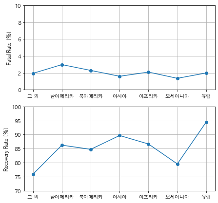

# FATAL & RECOVERY RATE by CONTINENTS
- __DATE__ : 2021.06.21~06.24
- __MEMBERS__ : Donghwa @dddonghwa, Minhyuk @BREAD-choi
- __SUBJECT__ : Visualization of Fatal & Recovery Rate by Continents 
- __COMPONENTS__ : 
    - 'team-project-01-02.ipynb/md' : source code + description ⭐️ READ MD FILE!
    - 'corona_today.csv' : corona data from coronaboard
    - 'wiki.csv' : a list of countries and continents from wikipedia
    - 'corona_total.csv' : added continents to corona_today
    - 'result.png' : final result - fatal & recovery rate by continents

## 목표
대륙별 코로나 사망률과 완치율의 시각화
#### 참조 링크
1) 코로나 실시간 상황판 [링크](https://coronaboard.kr/)  
2) 대륙별 나라 목록 [링크](https://ko.wikipedia.org/wiki/%EB%8C%80%EB%A5%99%EB%B3%84_%EB%82%98%EB%9D%BC_%EB%AA%A9%EB%A1%9D)

## 과정
- 주요 라이브러리 : `selenium` `bs4` `pandas`  

1. *1) 사이트*에서 국가별 코로나 사망률과 완치율 정보를 가져온다  
2. *2) 사이트*에서 국가 이름과 그 국가가 속한 대륙 이름을 가져온다.  
3. 국가별 사망률과 완치율, 국가가 속한 대륙 이름을 DataFrame으로 묶는다.  
4. 대륙별로 평균 사망률과 완치율의 평균을 구한다.  
5. 시각화한다.

## 결과

result.png

## 해석 및 향후 개선 사항
- 치명률에 비해 완치율의 분산이 크기 때문에 대륙에 따라서 완치율이 달라질 수 있다고 말할 수 있다.  
- 치명률과 완치율의 양상이 비슷하지 하지 않은 것으로 보았을 때 대륙별로 백신 보급, 의료환경 등 인위적이고 대륙마다 독립적인 요소들에 영향을 받았을 것으로 예상해볼 수 있다.  
- 전세계 백신 보급 현황 [링크](https://www.bbc.com/korean/features-56066227) 을 보았을 때 유럽 국가와 북아메리카의 보급률이 다른 국가에 비해 높은 것으로 확인되었다. 그럼에도 불구하고 완치율에 차이가 나는 것은 유럽에 비해 북아메리카의 의료 시설에 대한 접근성 등과 같은 대륙적 요소들의 영향을 끼쳤다고 생각해볼 수 있다.  
- 의료 후진국을 많이 포함하고 있는 아프리카 대륙의 치명률이 높을 것으로 예상하였지만, 다른 대륙들과 비슷한 수준의 치명률과 완치률을 가진 것으로 보아 인간의 면역체계와 백신 보급 등과 같은 국제적인 협조가 잘 작동하고 있다고 생각할 수 있다.   
- 사망률과 완치율은 서로 음의 상관관계를 가질 것으로 예상하였지만 분석해본 결과 그렇지는 않았다.  
