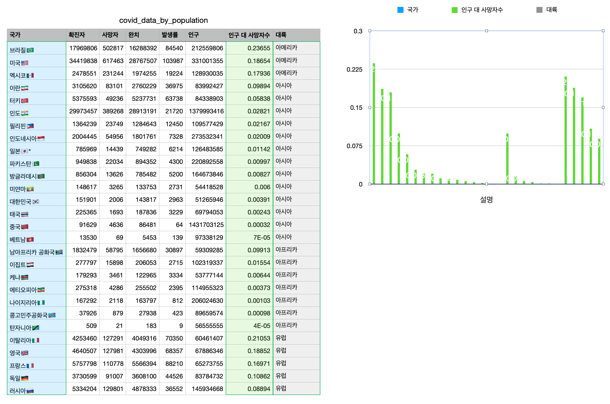
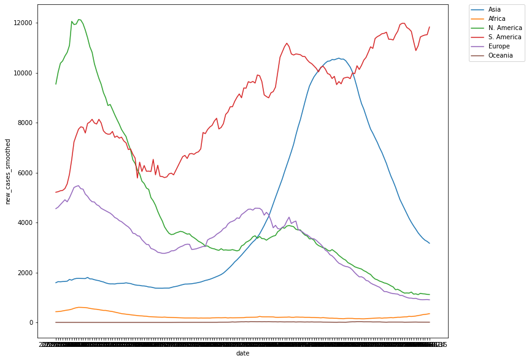

# 1차 팀프로젝트 - 코로나19 데이터 분석하기

Team. 이희희 (이성준, 조희창, 노진희)

# 코로나보드 크롤링 데이터를 통한 1차 분석 ([Colab 링크](https://colab.research.google.com/drive/1SAZNKOwWPicos4Asp8K0Q0CVTClExHTQ?usp=sharing))

- 코로나보드에서 가져온 데이터 안에서 의미있는 정보를 도출해내기
- 위에서 도출한 정보로 델타 변이와의 연관성 파악하기
- 엑셀을 통한 시각화

---

## 과정

- 인구와 인구 대비 사망자수를 계산
    - 인구: 확진자수 * 발생률 * 1,000,000
    - 인구 대비 사망자수: 사망자수 / 인구
- 대한민국보다 인구수가 큰 국가 선정 (총 28개국) - 인구수가 큰 나라에서 찾는 것이 유의미하다고 판단
- 인구 대비 사망자수로 정렬 (내림차순)
- 델타 변이와의 연관성 조사 (뉴스 기사 및 국가의 물리적 위치 참고)
    - [코로나 사투 1년반 400만명 사망…80개국 들불처럼 번지는 델타 변이 '변수'](https://n.news.naver.com/article/009/0004811263)

## 1차 결과

- 집계된 데이터 (신규확진자수, 사망자수) 그래프 추이를 살펴보았을 때 유의미한 값을 얻기 어려웠다.
    - 코로나19 초기에 누적된 사망자수로 인해 코로나보드 데이터만으로는 특정 시점(델타변이 시작) 이후의 값을 추출하기 어려웠음.

## 1차 결과에 대한 해석

- 유의미한 값을 필터링하는 것은 신중한 결정이 필요하다고 생각. (국가 선정 등)
- 특정 시점 이후의 값만을 사용하여 델타 변이와 수치의 변화를 파악하는 것은 좋은 분석과제가 될 것 → 2차 분석

## 인구 대 사망자수 내림차순 그래프 (대륙별)

---

---

# Our World in Data 데이터셋을 통한 2차 분석 ([Colab 링크](https://colab.research.google.com/drive/1kISsan0-mb-nhELoMu3n6MrBSCqz129y?usp=sharing))

- 1차 분석에서의 한계점을 극복한다. (누적 확진자수가 아닌 하루 신규 확진자수 받아오기)
- 델타변이의 영향력 파악하기
- Seaborn을 활용한 시각화

---

## 과정

- Our World In Data에서 실시간 코로나19 데이터셋(csv)을 받아서 pandas dataframe으로 바꿔본다. ([데이터셋 출처](https://github.com/owid/covid-19-data))
- 필요한 데이터만 정제한다.
    - 2021년 이후, columns: 대륙, 국가, 날짜, 신규 확진자수 (평균), 신규 사망자수 (평균), 인구
- 데이터를 재생산해본다. (열 추가: 인구 대비 하루 확진자수, 인구 대비 하루 사망자수)
- 여러가지 특성을 살려서 시각화를 해본다. (대륙별 하루 신규 확진자수/사망자수, 아시아내 국가의 인구 대비 하루 사망자수)

## 시기를 2021년 1월 이후로 자른 이유는?

- 델타변이의 발생 시점이 2020년 12월 추정.
- 실질적으로 영향을 끼쳤을 것으로 예상되는 2021년 1월 이후로 추림.

## 데이터 분석 (1 / 3)

신규 확진자수 (평균)

인구 대비 신규 사망자수 (평균)

- 신규 확진자수와 신규 사망자수를 비교하였을 때, 남미의 경우 두 그래프의 모양이 비슷했다.
- 아시아나 북미의 경우 그래프에서 유의미한 차이를 파악할 수 없었다.

→ 인구 대비 신규 확진자와 인구 대비 신규 사망자수를 비교하여 다시 확인

---

## 데이터 분석 (2 / 3)

인구 대비 신규 확진자수 (평균)

인구 대비 신규 사망자수 (평균)

- 두 그래프를 비교하였을 때, 아시아를 제외한 모든 대륙들은 비슷한 양상을 보였다.
- 아시아의 경우 신규 확진자수와 신규 사망자수의 그래프 양상이 다소 차이가 있었다.

## 데이터 분석 (3 / 3)

아시아 내 최근 2주간 신규 확진자수 상위 4개국의 인구 대비 사망자수 그래프
(이란, 필리핀, 인도, 인도네시아)

- 인구 대비 사망자수를 분석하여 해당 국가의 국민들이 느낄 코로나의 영향력을 파악할 수 있다.
- 인도의 막대한 신규확진자수로 인해 인구 대비 사망자수가 압도적으로 높을 것으로 예상했으나, 상대적으로 이란이 더 많은 영향을 받고있을 수 있다고 예측하였다.
- 인구
    - 인도 13.66억명
    - 이란 8291만명
- 이란의 사망자수와 인도의 사망자수 그래프는 서로 비슷한 추이를 보이므로 델타변이 등 연관관계가 있을 수 있다고 예측하였다.
- 델타변이는 2020년 12월에 발생하였지만 이란에서의 사망자수가 급증한 것을 보았을 때, 현재의 분석수준으로는 구체적인 원인을 파악할 수 없다고 판단하였다.

## 2차 결과에 대한 해석

- 대륙별로 분석하였을 때 유의미한 결과를 얻지 못하여, 상위 국가, 하위 국가 몇개를 추려서 다시 분석해보는 것이 좋을 것 같다.
- 아시아의 그래프 모양이 다른 예상 원인
    - 아시아의 전체 인구는 약 45억명 정도로, 인구 대비 신규 확진자/사망자 수를 대륙별로 분석하는 것은 유의미한 결과를 가져다주지 않았다.
        - 신규 사망자 수 ↑↑ / 인구수 ↑↑↑↑↑ = 인구 대비 사망자 수 ↑
- 인도에서의 급격한 확산으로 인해 사망자수가 제대로 집계되지 않았을 수 있다.

# 이 프로젝트를 통해 배운 점

- pandas dataframe을 활용하고 정제하는 경험을 가졌다.
    - 결측값 처리를 통해 부정확한 데이터를 제외하여 분석하는 법을 배웠다. (앵귈라, 왈리스 푸투나 등 정보가 없는 국가를 제외)
    - 자칫 전체 정보를 왜곡시킬 수 있는 데이터를 처리하는 건 단순한 작업이 아니라는 것을 깨달음. (수십만개의 데이터를 눈으로 확인할 수 없기 때문)
- seaborn을 통해 시각화를 하고 여러가지 옵션을 통해 범례, 라벨을 추가하는 등의 커스터마이징을 할 수 있었다.
- 팀원 모두 시각화된 데이터를 보며 데이터분석을 통해 유의미한 정보를 얻기 위해서는 신중한 판단, 시행착오와 많은 시간이 필요하다는 것을 깨달았다.

# 더 분석을 하게 된다면..

아시아 내의 인구 대비 확진자수와 사망자수의 그래프가 동일한 추이를 보이지 않은 원인을 파악하기 위해 다른 feature나 자료를 사용하여 더 연구해보기

1. 아시아에 대해 집중적으로 분석해본다.
    1. 인구별, 지역별(동 / 서 / 중동), 기후별로 분석
    2. 서아시아에서 동아시아로의 델타변이 이동경로 파악을 통한 분석
2. 전염력, 입원률 등을 델타변이가 발생하기 전 시점들과 비교하며 델타변이만의 특징을 파악해본다.
3. Reproduction rate(감염재생산률) 산정 방식을 파악하여 데이터의 신뢰성을 확보하여, 데이터를 재조합해본다.
    - 감염재상산률의 산정방식에 의문을 가지게 되어 데이터분석에 사용할 수 없었기 때문