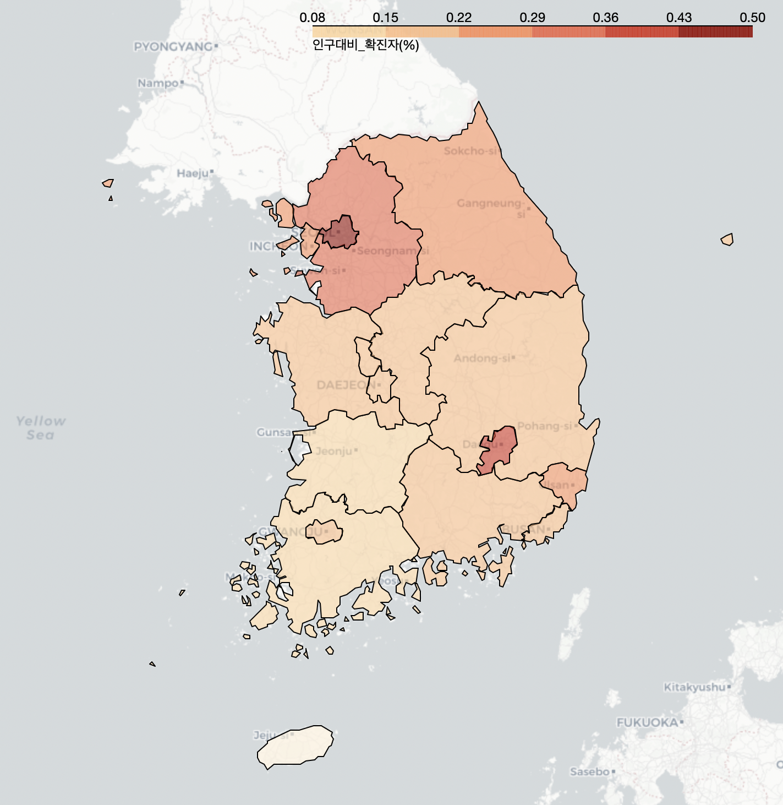

# AI School - 10회차
* 프로젝트로 익히는 실전 데이터 분석 및 딥러닝 입문

    파이썬@ 
       <a href='https://www.facebook.com/dongjo.lim.7'>LDJ</a>
    , [임동조](frontierlim13@gmail.com)

<h2><b>데이터 사이언티스트 실무자</b></h2>

## Notice for Team Project

데이터 분석 프로젝트 진행(대회 데이터 시각화, 모델 생성 및 평가)
* 기간 : 2021.07.16(금) ~ 2021.08.06(금)  
  * STEP 01. 팀 결성  
  * STEP 02. 팀별 대회 참여 2021.07.19 ~ 07.23  
  * STEP 03. 팀별 대회 결과 확인 2021.07.30(금) 
  * STEP 04. 팀별 대회 내용 정리 및 추가 분석
    * 최종 분석 제출 : 2021.08.05(금) 22:00
	* 제출 : frontier1020@naver.com
  * STEP 05. 2021.08.06(금) 11:00 ~ 최종 결과물 발표 

* 팀별 최종 발표    
  * 2021.08.06(금) 11:00 (10분~15분 내외)

## Reference Documents

##  Team Project : Kick Off

- <b>1st Subject </b>: <b>Analyze Social Issues Using BigData </b>
- <b>Our Motto   </b>: <b>Learning by doing, doing by learning !! </b>

<table border=1 bgcolor="#EEEEEE">
	<tr bgcolor="#CC0000">
		<td width="100">
		
<b>Team Name</b>

		</td>
		<td width="100">
		
<b>Team Building</b>

		</td>
		<td width="300">
		
<b>Project Detail</b>

		</td>
		<td width="120">
		
<b>Reports</b>

		</td>
	</tr>
	<tr>
		<td>
        
 팀명:모여봐요나뭇잎숲  (팀장:김남은)  
            <b></b>
		

		</td>
		<td>
            
김남은 부팀장(김현준),박성준, 최아름

        </td>
		<td>
			
 DACON_주차수요 예측 AI경진대회 
</td>
		<td>
            
     
            

        </td>
	</tr>
	<tr>
		<td>
        
 팀명:enter팀  (팀장:김혜린)  
            <b></b>
		

		</td>
		<td>
            
김혜린 부팀장(이준명), 양효진, 양소연

        </td>
		<td>
			
 \[DACON]주차수요 예측 AI경진대회 
</td>
		<td>
            
     
            

        </td>
	</tr>
	<tr>
		<td>
        
 팀명:의도치않은J들  (팀장:노진희)  
            <b></b>
		

		</td>
		<td>
            
노진희 부팀장(이성준), 김지연, 조희창

        </td>
		<td>
			
 \[DACON]주차수요 예측 AI경진대회 
</td>
		<td>
            
    
            

        </td>
	</tr>
	<tr>
		<td>
        
 팀명:보노보노 없는 보노보노팀  (팀장:정희경)  
            <b></b>
		

		</td>
		<td>
            
정희경  부팀장(전명운), 김민수, 이규림

        </td>
		<td>
			
 \[DACON] 주차수요 예측 AI경진대회 
</td>
		<td>
            
     
            

        </td>
	</tr>
	<tr>
		<td>
        
 팀명:점수내려줘  (팀장:남연주)  
            <b></b>
		

		</td>
		<td>
            
남연주  부팀장(이예준), 류지인, 최민혁 

        </td>
		<td>
		    
 \[DACON] 주차수요 예측 AI경진대회 
</td>
		<td>
            
     
            

        </td>
	</tr>
	<tr>
		<td>
        
 팀명:gs동물  (팀장:김동화)  
            <b></b>
		

		</td>
		<td>
            
김동화  부팀장(안현우), 이응진, 이지은 

        </td>
		<td>
		    
 \[DACON] 주차수요 예측 AI경진대회 
</td>
		<td>
            
  
	        

        </td>
	</tr>
</table>

 
### 멋쟁이 사자처럼 실무 데이터 사이언티스트 1기!  최고 멋진 친구들 버전 화이팅!!! ver3 ^^

##  Team Project : Final Report
- <b>Submission   </b>: 결과보고
- <b>Presentation </b>: 10min / team, Q&A
- <b>Keep in mind </b>: <b> Share Lessons Learned !! </b>

 

 &lt; The End &gt; 

